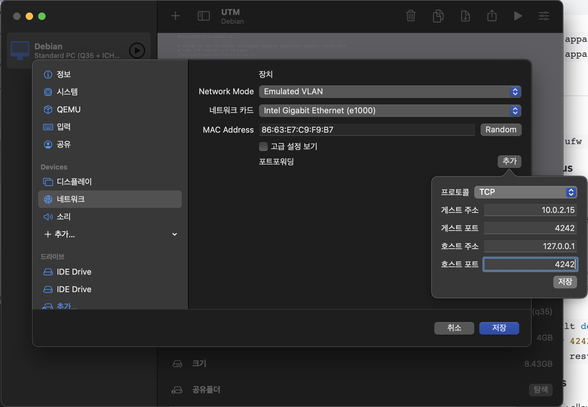
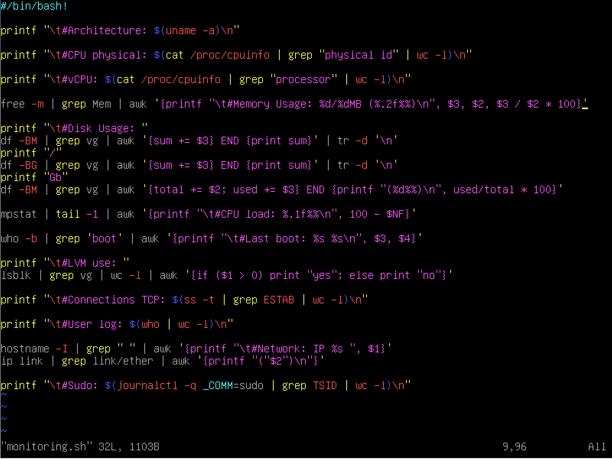

# 과제 개요
가상머신을 설치하여 비밀번호 정책이나 user, 크론 등을 설정하는 과제

# 정리한 것
## Setup Debian

- [x] The hostname of your virtual machine must be your login ending with 42 (e.g., yena42). You will have to modify this hostname during your evaluation.
- [x] In addition to the root user, a user with your login as username has to be present.

### Partitioning

- [x] You must create at least 2 encrypted partitions using LVM

## Installing sudo

```
apt-get update
apt-get install sudo
```

## Set up sudo

```
visudo
```

### Strong configuration for sudo group

- [x] For security reasons too, the paths that can be used by sudo must be restricted.
    Example: /usr/local/sbin:/usr/local/bin:/usr/sbin:/usr/bin:/sbin:/bin:/snap/bin
    
    ```
    ## visudo
    Defaults secure_path=" /usr/local/sbin:/usr/local/bin:/usr/sbin:/usr/bin:/sbin:/bin:/snap/bin"
    ```
    
- [x] Authentication using sudo has to be limited to 3 attempts in the event of an incorrect password.
    
    ```
    ## visudo
    Defaults	passwd_tries=3
    ```
    
- [x] A custom message of your choice has to b displayed if an error due to a wrong password occurs when using sudo.
    
    ```
    ## visudo
    Defaults badpass_message="Wrong Password :("
    ```
    
- [x] Each action using sudo has to be archived, both inputs and outputs. The log file has to be saved in the /var/log/sudo/ folder.
    
    ```
    ## visudo
    Defaults	log_input
    Defaults	log_output
    Defaults	iolog_dir="/var/log/sudo/"
    ```
    
- [x] The TTY mode has to be enabled for security reasons.
    
    ```
    ## visudo
    Defaults	requiretty
    ```

## Set up Groups

- [x] This user has to belong to the user42 and sudo groups.
    
    ```
    groupadd user42
    ```
    
    ```
    usermod -aG sudo,user42 yena
    ```

## (Install dpkg-dev)

```
sudo apt-get install dpkg-dev
```

## App Armor

### Check if app armor has been installed

```
sudo dpkg -l apparmor
```

### Install app armor

```
sudo apt install apparmor
sudo apt install apparmor-utils
```

## UFW firewall

### Install UFW

```
sudo apt install ufw
```

### Check UFW status

```
sudo ufw status verbose
```

### Activate UFW on system startup

```
sudo ufw enable
```

- [x] You have to configure your operating system with the UFW firewall and thus leave only port 4242 open.
    
    ```
    sudo ufw default deny
    sudo ufw allow 4242
    ```

### Extra Commands

- `sudo ufw status`: allow된 포트 확인
- `sudo ufw deny [port]`: 해당 포트 deny
- `sudo ufw delete`: = `deny`

## SSH

### Check if openssh has been installed

```
sudo apt search openssh-server
```

### Install openssh

```
sudo apt install openssh-server
```

### Set up SSH

```
sudo vim /etc/ssh/sshd_config
```

- [x] A SSH service will be running on port 4242 only. For security reasons, it must not be possible to connect using SSH as root.
    
    ```
    ## /etc/ssh/sshd_config
    ...
    Port 4242
    ...
    PermitRootLogin no
    ```
    
    ```
    sudo systemctl restart ssh
    ```
    
### Port fowarding

#### Check IP of Debian

```
ip addr

2: enp0s1...
    inet 10.0.2.15...
```

#### Port forwarding

- UTM
    

- VirtualBox
  - UTM과 동일하게 `Network` 설정에서 작업

⚠️가상 머신 살아있을 때 실행할 것!

```
## Iterm
~ ❯ ssh yena@127.0.0.1 -p 4242                                                                                ✘ INT 16s
yena@127.0.0.1's password:
Linux yena42 5.10.0-19-amd64 #1 SMP Debian 5.10.149-2 (2022-10-21) x86_64

The programs included with the Debian GNU/Linux system are free software;
the exact distribution terms for each program are described in the
individual files in /usr/share/doc/*/copyright.

Debian GNU/Linux comes with ABSOLUTELY NO WARRANTY, to the extent
permitted by applicable law.
Last login: Tue Nov  8 06:40:14 2022 from 10.0.2.2
yena@yena42:~$
```

### Error: REMOTE HOST IDENTIFICATION HAS CHANGED!

> [https://visu4l.tistory.com/entry/ssh-원격-접속-에러WARNING-REMOTE-HOST-IDENTIFICATION-HAS-CHANGED](https://visu4l.tistory.com/entry/ssh-%EC%9B%90%EA%B2%A9-%EC%A0%91%EC%86%8D-%EC%97%90%EB%9F%ACWARNING-REMOTE-HOST-IDENTIFICATION-HAS-CHANGED)

```
## Iterm

~ ❯ rm ~/.ssh/known_hosts                                                                                             11s
```

## Password policy

### Default

```
vim /etc/login.defs
```

- [x] Your password has to expire every 30 days.
    
    ```
    ## /etc/login.defs
    PASS_MAX_DAYS 30
    ```
    
- [x] The minimum number of days allowed before the modification of a password will be set to 2.
    
    ```
    ## /etc/login.defs
    PASS_MIN_DAYS 2
    ```
    
- [x] The user has to receive a warning message 7 days before their password expires.
    
    ```
    ## /etc/login.defs  
    PASS_WARN_AGE 7
    ```
    
### Libpam-pwquality

```
sudo apt install libpam-pwquality
```

```
sudo vim /etc/pam.d/common-password
```

- [x] Your password must be at least 10 characters long. It must contain an uppercase letter and a number. Also, it must not contain more than 3 consecutive identical characters.
    
- [x] The password must not include the name of the user.
    
- [x] The following rule does not apply to the root password: The password must have at least 7 characters that are not part of the former password.
    
    ```
    ## /etc/pam.d/common-password
    ## here are the per-package modules (the "Primary" block)
    password	requisite		pam_pwquality.so retry=3 minlen=10 dcredit=-1 ucredit=-1 maxrepeat=3 reject_username enforce_for_root difok=7
    ```
    
- [x] Of course, your root password has to comply with this policy
    
```
chage -l [user] // user list
chage -m 2 -M 30 -W 7 [user]
```

```
passwd -e [user] // immediately expire an account's password, and force a user to change password at next login
```

## monitoring.sh

- [ ] At server startup, the script will display some information on all terminals every 10 minutes.

```shell
wall $(bash monitoring.sh)
```

- [x] No error must be visible.
    
- [x] The architecture of your operating system and its kernel version.

    ```bash
    uname -a
    ```
    
- [x] The number of physical processors.
    
    ```bash
    cat /proc/cpuinfo | grep "physical id" | wc -l
    ```
    
- [x] The number of virtual processors.
    
    ```bash
    cat /proc/cpuinfo | grep "processor" | wc -l
    ```
    
- [x] The current available RAM on your server and its utilization rate as a percentage.
    
    ```bash
    free -m | grep Mem | awk '{printf "%d\%dMB (%.2f%%)", $3, $2, $3 / $2 * 100}'
    ```
    
- [x] The current available memory on your server and its utilization rate as percentage.
    
    ```bash
    df
    ```
    
- [x] The current utilization rate of your processors as a percentage.
	>  - [https://zetawiki.com/wiki/...](https://zetawiki.com/wiki/%EB%A6%AC%EB%88%85%EC%8A%A4_CPU_%EC%82%AC%EC%9A%A9%EB%A5%A0_%ED%99%95%EC%9D%B8)
	> - <https://www.baeldung.com/linux/get-cpu-usage>

	- 방법 1) `mpstat`
		```shell
		apt install sysstat
		```

		```bash
		mpstat | tail -1 | awk '{print 100 - $NF}'
		```
 
 	- 방법 2) `vmstat`
		```bash
		100 - $(vmstat 1 2 | tail -l | awk '{print $15}')
		```
		
	- 방법 3) `top`
		```bash
		top -b -n 1 | grep -Po '[0-9.]+ id' | awk '{print 100-$1}'
		```
 
- [x] The date and time of the last reboot.
    
    ```bash
    who -b
    ```
    
- [x] Whether LVM is active or not.
    ```bash
	lsblk | grep vg | wc -l | awk '{if ($1 > 0) print "yes"; else print "no"}'
	```
- [x] The number of active connections.
	```bash
	ss -t | grep ESTAB | wc -l
	```
    
- [x] The number of users using the server.
    ```bash
	who | wc -l
	```
- [x] The IPv4 address of your server and its MAC (Media Access Control) address.
    
    ```bash
    hostname -I
    ```
	```bash
	ip link | grep link/ehter | awk '{print "("$2")"}'
	```
- [x] The number of commands executed with the sudo program.
    
    ```bash
    journalctl _COMM=sudo | grep TSID | wc -l
    ```

### Whole script


### Crontab Setting
```bash
vim /etc/crontab
```

```shell
## /etc/crontab

SHELL=/bin/sh
PATH=/usr/local/sbin:/usr/local/bin:/sbin:/bin:/usr/sbin:/usr/bin

*/10 * * * * root /root/monitoring.sh | wall
```

```bash
sudo reboot
```

참고) 시스템 전체가 아닌 사용자에게만 해당하는 크론의 경우, `crontab -e`에서 설정

## Dhclient 삭제

```
ss -tunlp
```

### 가상 환경 gateway 주소 확인

```
ip route
```

```
default via 10.0.2.2 dev enp0s1
10.0.2.0/24 dev enp0s1 protokernel scope link src 10.0.2.15
```

### IP 설정 변경

```
sudo vim /etc/network/interfaces
```

```
## /etc/network/interfaces
## ...
## The loopback network interface
auto lo
iface lo inet6 loopback

## The primary network interface 
allow-hotplug enp0s1
iface enp0s1 inet static
address 10.0.2.15
netmask 255.255.255.0 #24
gateway 10.0.2.0
```

```
sudo ifdown /etc/network/interfaces
sudo ifup /etc/network/interfaces
## 필요 시
sudo reboot /etc/network/interfaces
```

## Defense Reference

### LVM

> - [https://tech.cloud.nongshim.co.kr/2018/11/23/lvmlogical-volume-manager-1-개념/](https://tech.cloud.nongshim.co.kr/2018/11/23/lvmlogical-volume-manager-1-%EA%B0%9C%EB%85%90/)
> - https://greencloud33.tistory.com/41

**Logical Volume을 효율적이고 유연하게 관리하기 위한 커널의 한 부분이자 프로그램**. 파일 시스템이 LVM이 만든 가상의 블록 장치에 읽고 쓰기를 한다.

LVM은 파티션 대신 volume 이라는 단위로 저장 장치를 다룬다.

#### 장점

- 유연한 용량 조절
- 크기 조절이 가능한 storage pool
- 편의에 따른 장치 이름 지정
- disk striping, mirror volume 등을 제공

### aptitude vs apt

> https://velog.io/@joonpark/aptitude-vs-apt

#### aptitude

high-level 패키지 관리 도구.
데비안을 위해 만들어졌지만, rpm 기반 패키지까지 확장된다.
대화형 인터페이스와 CLI 환경에서도 작동한다.
apt-get, apt-cache 기능을 포함하며, **설치된 패키지 목록, 패키지 자동/수동 설치 표시, 업그레이드에 사용할 수 없는 패키지 보관** 등의 일을 한다.

#### apt; advanced packaging tool

**패키지 관리 툴**.
초기에는 .deb 패키지를 관리하기 위해 만들어졌지만, 현재는 rpm 패키지 매니저와도 호환된다.

### apt vs apt-get

> https://ksbgenius.github.io/linux/2021/01/13/apt-apt-get-difference.html

내부 동작에서의 차이는 없다.

**apt-get은 더 많은 옵션과 기능을 제공**해주고, **apt는 apt-get에서 자주 사용하는 옵션을 추출**하여 사용자의 편의성을 향상시켰다.

최종적으로는 둘 중 아무거나 써도 상관 없지만, apt-get은 오래 전부터 존재해왔고, 더 안정적이고 높은 호환성을 가지고 있다. 따라서 굳이 제한된 기능을 가진 apt를 쓸 필요는 없다고 생각한다.

### SELinux

> - https://www.redhat.com/ko/topics/linux/what-is-selinux
> - https://www.lesstif.com/ws/selinux-understanding-selinux-43843822.html

**SELinux(Security-Enhanced Linux)는 관리자가 시스템 액세스 권한을 효과적으로 제어할 수 있게 하는 Linux 시스템용 보안 아키텍처**이다.

권한이 거부되면 "avc: denied"라는 메시지가 /var/log.messages에 나타난다.

### Rocky
> - https://rockylinux.org/ko/
> - https://docs.rockylinux.org/books/admin_guide/13-softwares/

Red Hat Enterprise Linux와 100% 버그 간 호환이 가능하도록 설계된 오픈 소스 엔터프라이즈 운영 체제이다.

RedHat Package Manager로 rpm, dnf를 사용한다.

### Debian
> - https://www.debian.org/intro/why_debian
> - https://www.debian.org/doc/manuals/debian-faq/pkgtools.en.html

Debian은 자유 오픈 소스 소프트웨어로 만들며 무료이다. 누구나 사용, 수정 및 배포할 수 있다.

Package Manager로 dpkg, apt, aptitude, synaptic(graphical), tasksel 등을 사용한다.

### AppArmor

> https://ko.wikipedia.org/wiki/AppArmor

AppArmor는 시스템 관리자가 프로그램 프로필 별로 프로그램의 역량을 제한할 수 있게 해주는 **리눅스 커널 보안 모듈**이다.

프로필들은 네트워크 액세스, raw 소켓(인터넷 프로토콜 패킷을 직접적으로 주고 받게 해주는 인터넷 소켓) 액세스 그리고 파일의 읽기, 쓰기, 실행 같은 기능을 허용할 수 있다.

AppArmor는 강제적 접근 통제(MAC)를 제공함으로써 전통적인 유닉스 임의적 접근 통제(DAC) 모델을 지원한다.

#### 접근 통제 (Access Control)

> https://www.lesstif.com/ws/access-control-dac-mac-43843837.html

운영체제에서 접근 통제는 디렉터리나 파일, 네트워크 소켓 같은 **시스템 자원을 적절한 권한이 있는 사용자나 그룹이 접근하고 사용할 수 있게 통제**하는 것을 의미한다.

접근 통제에서는 시스템 자원을 객체(Object)라고 하며, 자원에 접근하는 사용자나 프로세스는 주체(Subject)라고 정의한다.
예) /etc/passwd 파일: 객체, passwd 명령어: 주체

##### 임의 접근 통제(DAC; Discretionary Access Control)

- 시스템 객체에 대한 접근을 사용자나 그룹의 신분을 기준으로 제한하는 방법
- **사용자나 그룹이 객체의 소유자라면, 다른 주체에 대해 이 객체에 대한 접근 권한을 설정**할 수 있다
- 임의의 뜻은 소유자가 임의대로 권한을 줄 수 있다는 의미이다
- 구현이 용이하고 사용이 간편하기 때문에 전통적으로 대부분 운영체제의 기본 접근 통제 모델로 사용되고 있다
- 단, 사용자의 권한을 탈취당한 경우에 사용자가 소유하고 있는 모든 객체의 접근 권한까지 넘어갈 수 있는 문제가 있다.

##### 강제 접근 통제(MAC; Mandatory Access Control)

- **미리 정해진 정책과 보안 등급에 의거**하여 주체에게 허용된 접근 권한과 객체에게 부여된 허용 등급을 비교하여 접근을 통제하는 모델
- 높은 보안을 요구하는 정보는 낮은 보안 수준의 주체가 접근할 수 없고, 소유자라 할 지라도 정책에 어긋나면 객체에 접근할 수 없으므로 강력한 보안을 제공한다
- 접근 가능한 파일과 포트가 제한되기 때문에, 사전에 허용된 포트만 접근이 허용되므로 해킹으로 인한 2차 피해를 최소화할 수 있다
- 구현이 복잡하고 어려우며, 모든 주체와 객체에 대해서 보안 등급과 허용 등급을 부여해야 하므로 설정이 복잡하다

### SSH; Secure Shell Protocol

> https://baked-corn.tistory.com/52

네트워크 프로토콜 중 하나로, 컴퓨터끼리 인터넷과 같은 Public Network를 통해 **서로 통신(데이터 전송, 원격 제어 등)을 할 때 보안적으로 안전하게 통신을 하기 위해 사용하는 프로토콜**이다.

SSH는 Public Key와 Private Key를 통해 접속하려는 컴퓨터와 인증 과정을 거친다.

Public Key는 공개되어도 비교적 안전한 Key이다. Public Key를 통해 메시지를 전송하기 전 암호화를 한다.

Private Key는 절대 외부에 노출이 돼서는 안 되는 Key이다. 이는 컴퓨터 내부에 저장되어 있으며, Private Key를 통해 암호화된 메시지를 복호화 할 수 있다.

두 개의 Key로 통신하는 방법은 다음과 같다.

1.  Public Key를 통신하고자 하는 컴퓨터에 복사하여 저장한다
2.  클라이언트에서 접속 요청을 할 때, 서버에 복사되어 저장된 Public Key와 클라이언트의 Public Key와 쌍을 이루는 Private Key를 비교하여 서로 한 쌍의 Key인지 검사한다
3.  한 쌍의 Key임이 증명되면, 두 컴퓨터 사이에 암호화된 채널이 형성되고, Key를 활용해 메시지를 암호화/복호화 함으로써 데이터를 주고 받는다.

### DHCP; Dynamic Host Configuration Protocol

**호스트의 IP 주소와 각종 TCP/IP 프로토콜의 기본 설정을 클라이언트에게 자동으로 제공**해주는 프로토콜.
네트워크에 사용되는 IP 주소를 DHCP 서버가 중앙집중식으로 관리하는 클라이언트/서버 모델을 사용한다.

### IP

#### Loopback

> https://woo-dev.tistory.com/190

127.0.0.1로, 루프백 또는 로컬호스트 라고도 불린다.
만약 패킷의 목적지 IP를 127.0.0.1로 설정하면, 네트워크 계층은 그 패킷을 외부로 전송하지 않고 자신이 다시 받은 것처럼 처리하며, 상위 계층으로 올려 보낸다. 즉, **자신이 송신한 패킷을 그대로 수신한 효과**를 준다.

기술적으로는 127.0.0.x에 해당하는 모든 주소가 루프백이라고 한다. 그러나 일부 운영체제는 127.0.0.1만 루프백으로 인식한다.

#### lo
> https://unix.stackexchange.com/questions/148735/what-does-eno1-and-lo-mean

루프백 장치. 127.0.0.1의 IP 주소를 가지며, **로컬에서 네트워크 서비스에 접근하는 데 사용**될 수 잇다.

### secure_path
> https://www.tuwlab.com/ece/24044

sudo에서 제공하는 보안 기능이다. 
**sudo 명령을 실행할 때 현재 계정의 쉘이 아닌 새로운 쉘을 생성하여 그 쉘에서 명령을 실행한다. 이때 명령을 찾을 경로를 나열한 환경변수인 PATH값**이 secure_path이다.

secure_path를 이용하면 **트로이 목마 해킹 공격에 대한 일차적인 방어 기능**을 제공한다.

### Commands

#### User 관련

- `user -g <group> <user>`: 그룹이 primary group이 되도록 함
- `adduser <user>`: 유저 추가
- `deluser <user>`: 유저 삭제
- `addgroup <group>`: 그룹 추가
- `delgroup <group>`: 그룹 삭제
- `cat /etc/group`: group list 출력
- `id <user>`: 유저가 속한 그룹 출력

#### 현재 유저의 hostname  변경
-  `hostnamectl`:  현재 호스트 이름 표시
- `sudo hostnamectl set-hostname [hostname]`

## VI

### Commands

| Type | Commands | Description |
| --- | --- | --- |
| Insert | a   | 커서 뒤에 글자 삽입 |
|     | i   | 커서 앞에 글자 삽입 |
| Delete | x   | 커서 글자 삭제 |
|     | X   | 커서 앞 글자 삭제 |
| Undo | u   | cmd + z / ctrl + z |
| Redo | ctrl + r | cmd + y / ctrl + y |
| Move | ↑, ↓, ←, → | 커서 이동 |

## Install Vim

```
sudo apt install vim
```

## Account Info

- root pw: Qwertyasdf1 -> Password1012
- yena pw: WeLove42 -> EspressoConpanna1
- LVM pw: EncryptDisk1

# 어려웠던 점
## 설치 파일 용량 문제
debian 설치 파일을 다운받는데, 클러스터 맥에서는 용량 제한이 걸려 있어서 내 계정의 home 폴더 밑에는 용량 문제로 다운을 받을 수 없었다.  
따라서 열심히 슬랙을 뒤져봤는데, goinfre에 설치 파일을 다운받아야 한다는 글을 봤다. goinfre는 다른 맥에 로그인 할 경우, 이전에 자리의 맥의 goinfre 내 데이터를 전부 삭제하는 폴더이다.

이 문제는 뒤의 백업 문제와 이어진다.

## 백업
가상 머신에서 작업을 하다보면 내가 하루만에 모든 작업을 끝내지 못하는 상황이 생길 것이다. 이에 여지껏 작업한 것들을 어떻게 백업하느냐가 문제인데, 구글 드라이브에 가상 머신 폴더를 통째로 백업해두는 방식을 사용한다고 한다.  

usb로 작업하려니 usb로 하면 엄청나게 느리다는 얘기를 들어서... 이 악물고 구글 드라이브에 백업했다. 압축 파일만 거의 7.5기가인가? 였던 것 같다.

## 클러스터 맥과 내 맥북의 환경 차이
솔직히 클러스터가 개인적으로는 답답해서 주로 조금 트여있는 오픈 라운지나 집현전, 날이 따뜻할 때에는 아예 옥상에 가서 작업하고는 했다. 그래서 내 맥에서 작업하고 클러스터 맥에 파일을 그대로 가져갔는데, 여지껏 문제가 없었지만 이번 과제를 하면서 문제가 생겼다.  
내 맥북 칩셋이 m1인데, virtual box는 m1을 지원하지 않는다. 따라서 선택지는 두 가지였는데, 집에 있는 윈도우가 깔린 데스크탑으로 하든지, 아니면 내 맥북에서 utm으로 실습을 하고 클러스터 맥에서 똑같이 구현하든지였다.

결국 내 맥에서 utm으로 실습하고 스크립트 작성하는 것과 크론까지 전부 거기서 실습하고 클러스터 맥에 똑같이 구현하는 방식을 택했다.

## 크론 처음 써봤다
멘토링 할 때에도 크론, CI/CD에서도 크론 얘기가 나오길래, 크론이 뭐지 했는데 드디어 써보니 뭔지 알 것 같았다. `vi /etc/crontab`과 `crontab -e`의 차이를 처음엔 몰랐어서 `crontab -e`에 스크립트 출력 설정해놓고, "어 왜 안 되지?" 하면서 여기서도 시간 좀 잡아 먹었었다.  

# 여담
## sudo sudo sudo
실습할 때에는 자꾸 sudo 치기 귀찮아서 root로 작업하는 게 버릇되니까, 평가에서도 root가 아닌 다른 유저에서 sudo 없이 명령어 치다가 자꾸 그런 명령어 모르겠는뒙 하면서 날 당황하게 했다. root 계정에선 잘만 되던 명령어가 "? 왜 안 되는 거야" 싶으면 sudo를 붙여보자...
