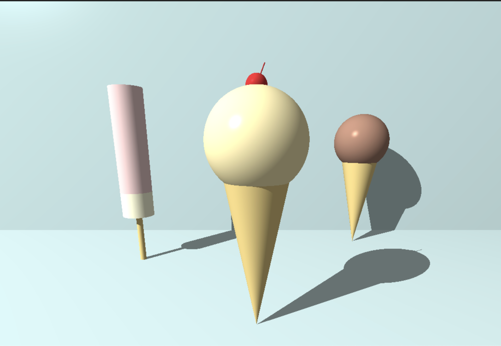

# 잡담
사실 minirt 끝난지는 거의 2주하고 조금 더 됐는데... 계속 써야지 써야지 하다가 이제라도 팀으로 어떻게 일을 하면 좋을지 고민한 것들에 대해 기록해두려 한다. 그래서 과제에 대해 어떤 식으로 구현하면 좋을지 같은 내용보다는 팀으로서의 협업에 대해 느낀 점을 쓸 것이다.

# 첫 번째 팀 과제, minishell
## 무서워요
첫 번째 팀 과제는 악명 높은 minishell이었다. 평가하러 오는 사람들이 어떻게든 터뜨리려 하는 자들이 악랄한 케이스를 들고 와서 프로그램을 폭파시킨다는 얘기를 많이 들었던지라 긴장을 많이 했었다. 실제로 나는 사실 쉘을 그닥 좋아하지도 않았고, pipe 개념에 대해 딱히 흥미도 없었던지라 이 과제는 유독 하기 싫고 평가가 무서웠다. 그래도 어쩌겠나, 해야지.

## 팀원 구하기
감사하게도 나한테 먼저 같이 하자고 손을 내밀어 주신 분이 계셨다. 인트라까진 밝히지 않겠지만 사실 내 깃허브 보면 누구랑 했는지 나온다. 누구랑 해야 하나 고민하고 있던 차에 잘 됐다 싶기도 했고 믿음이 가는 분이었기에 고민하지 않고 바로 같이 하기로 했다.

## 진행하면서 배운 점
### 트리 구조
내가 minishell에서 사용자가 입력한 문자열을 파싱하는 역할을 맡았었다. 이때 우리는 보너스까지 해보자고 해서 추상 구문 트리(AST; Abstract Syntax Tree)를 이용했는데, 오랜만에 한 번에 이해가 되지 않는 내용이었다. 주변에 언어학과를 나오신 분이 계셔서 그 분의 도움도 받아 겨우 이해하고 해당 내용을 구현했다. 서브 트리를 만들어서 부모 트리의 오른쪽 노드로 붙인다든가 등의 작업을 할 때에는 직접 lldb로 디버깅하면서 제대로 붙었는지를 확인하기도 했다.

그리고 사실 이론적으로만 트리 구조는 이렇게 생겼다는 걸 알고 있었지, 이진 트리 형태를 직접적으로 구현해 본 적은 처음이라 색다른 느낌이었다. 다음에 트리를 구현하라고 하면 할 수 있을 것 같다.

### 공식 문서 읽기
사실 공식 문서를 아예 안 읽어 본 것은 아니지만, 생각보다 많은 내용이 공식 문서에 적혀 있었다. 평가를 받을 때 놓친 부분에 대해 평가자 분들께서 공식 문서에서 그 내용을 찾는 걸 보고 공식 문서를 제대로 읽어봐야겠다 싶었다.

### 팀으로서 일하기
이 부분이 제일 느낀 게 많았다. 특히 두 가지 부분이 있는데, 하나는 일정 관리였고, 다른 하나는 일하는 스타일에 관련된 것이었다.

#### 일정 관리
라피신의 Rush 때와는 다르게 본과정 팀 과제는 최소 2주 내지는 몇 달 까지도 걸린다. 게다가 팀원도 2명에서 5명 정도로 다양한데, 그 팀원들이 언제 시간이 되는지, 언제까지 어느 정도의 작업을 해올 수 있는 지에 대한 일정 관리가 관건이라고 생각한다.

그 부분에 있어서 minishell을 진행할 때에는 부족한 점이 있었다.
서로의 일정 공유가 미흡했고, 팀원이 자신의 일정 내에서 소화하기 어려운 작업에 대해서는 그 작업에 대해 빠르게 다른 팀원과 분량을 나눴어야 했다. 그러다보니 한 주면 끝날 작업이 3일이 되고, 5일이 되고, 결국에는 일주일이 밀려나는 사태가 벌어졌다. 이 부분에 대해 **일정 공유는 바로바로 해야한다**는 점을 뼈저리게 느꼈다.

#### 일하는 스타일
나는 레고 부품 조립하듯이 각자 어느 파트를 해오기로 정하면, 일정 기간 동안 내 파트를 하고, 한 번 다같이 모여서 합치는 방식을 선호한다. 즉, 내 파트를 하는 기간에는 개인적으로 작업하는 걸 좋아한다. 그런데 모든 사람이 다 내가 아니듯이 다들 내가 선호하는 방법을 선호할 거란 보장은 없다. 그렇게 **일하는 스타일이 다르면 어떻게 해야될까? 적당한 타협점을 찾아야 한다.**

나는 클러스터에 하루 종일 상주하는 것보다 오늘 하기로 정한 일이 끝나면 집에 가는 식이었어서, 같이 코드를 짜다가도 내 일이 끝나면 그냥 집으로 가곤 했다. 그때 팀원분께서 몇 번 나한테 "같이 코드를 짜야 잘 되는 느낌"이라며 시그널을 보내주신 적이 있었다. 그런데 나는 그냥 "내 일 끝났으니 난 갈거야!" 하는 마인드로 집에 가버려서 이 부분도 문제가 되었으리라 확신한다. 이 부분에 대해서는 내가 일부는 양보해서 같이 시간을 냈으면 더 나은 결과가 있지 않았을까 한다.

## 과제가 끝나고
우선 블랙홀이 이틀 남았었던 나를 위해 평가에도, 밤샘 작업에도 애써주셨던 팀원 분께 진심으로 감사했다. 여담으로 내가 밤을 아예 새울 때, 내 신체에 어떤 변화가 일어나는지도 알게 됐다. 목이 안 돌아간다든가, 두통이 심해진다든가, 집 가서 잠을 자려고 하는데 오히려 잠이 안 오는 등 이상한 일이 있었고 그 후폭풍은 일주일 내내 갔다. 진심으로 밤샘 작업은 절대 하면 안 되겠다. 결과는 조금 아쉬웠지만, 팀으로 일하는 것에 대해 배워가는 점이 많은 과제였다. 

그렇게 minishell 과제가 끝나고 내가 느꼈던 일정 관리, 일하는 스타일에 대한 문제점들을 개선하기 위해 다음 과제 minirt에서는 이 부분을 고려하여 진행하겠다고 다짐했다.

# 두 번째 팀 과제, minirt
> 
> 미리 보는 결과물

## 달라진 마인드
### 팀원은 랜덤으로 구하겠다
원래는 끝까지 아는 사람끼리 팀을 해서 가려고 했는데, 생각이 바뀌었다. pedagogy 팀에서 동료 학습에 대해 얘기한 적이 있었는데, 아는 사람끼리만 팀을 구성해서 처음부터 끝까지 가는 사람들이 많다고 한다. 즉, 새로운 동료를 구하지 않는 비율이 많았다는 것이다.

그래서 "새로운 동료를 구하는 데 어려움이 있는 사람들은 어떡하지?" 하는 생각이 들었다. 그리고 내가 왜 42에 들어왔는지 초창기의 목적을 생각했을 때, 나는 42에서 최대한 많은 유형의 사람을 만나면서 A같은 사람과 일할 때에는 어떤 식으로 해야하는지, B같은 사람과 일할 때에는 어떻게 해야하는지를 익히고 싶었다는 걸 떠올렸다. 그래서 나는 앞으로 모든 팀과제는 슬랙을 통해 랜덤으로 팀원을 모집하기로 했다. ~~자체 하드 모드~~

### 빠른 일정 공유와 협업 스타일 정하기
minishell때 느꼈던 일정 공유를 할 때 빠르게 알리는 것(최소 일주일 전에는 말하는 게 좋지 않을까 싶었다), 그리고 협업 스타일에 대해서도 내가 원하는 방식만 밀기 보다는 상대방의 방식에도 맞춰줘야겠다 다짐했다.

## 팀원 구하기
minirt가 수학으로 점철된 과제라 그런지, 2-3명 정도 연락이 올 거라는 기대와는 다르게 딱 한 분으로부터 연락이 왔었다. 그 분의 인트라 정보를 살짝 봤는데, 클러스터 출석도 열심히 하시고 과제를 진행하는 속도 빠르셔서 망설임 없이 같이 하자고 했다.

## 진행하면서 있었던 일
### 서로에 대해 알아가기
나는 모르는 사람과 단 둘이 한 방에 있어도 몇 시간 동안 말 한 마디 나누지 않을 자신이 있다. 그만큼 성격이 타인에게 크게 관심을 두지 않는다. 그런데 이건 팀 과제니까, 협업이니까, 용기를 좀 많이 내서 먼저 팀원 분께 이런저런 질문을 했었다. 왜 minirt 를 선택하셨는지부터 평소에 어떤 식으로 일하는 걸 좋아하시는지 등등. 그래야 서로 맞춰가기 쉬울 것 같았다. 꽤나 적극적으로 얘기를 나눴어서 사적으로 mbti 얘기를 했을 때 내가 INTJ처럼 안 보인다고 하셨다.

### 주기적으로 만납시다
나도, 팀원 분도 서로를 처음 봤기에, 만약 주간 목표를 정했을 때 잘 해올지, 버겁지는 않을지를 모른다. 그래서 안전장치로 일주일에 두 번은 만나서 같이 코드를 짜기로 했다. 그렇게 한 주 정도를 보냈을 때, 스스로 잘 해오시고 계셔서 한시름 놓을 수 있었다.

### 일정 공유 및 관리
내가 이때 사랑니를 빼러 다녔을 때라, 언제 뭘 할 건지 간략하게 언급이라도 했었다. 진짜 급한 일이 생기면 최소한 하루 전에는 말씀드렸고, 그럼에도 주간 목표는 달성하며 관리도 열심히 했다.

### 일하는 스타일 협의
일하는 스타일에 대해 주기적으로 만나서 코드를 짜기로 했었다. 그런데 3주차였나, 그때 갑자기 "yena님, 드릴 말씀이 있습니다!" 하면서 나에게 만나서 코딩하는 횟수를 줄였으면 한다고 팀원 분께서 말씀해주셨다. 먼저 들었던 생각은 용기내서 말씀해주신 점에 대해 감사하다는 것이었고, 그 다음으로 들었던 생각은 "오?" 였다. 얘기를 쭉 들어보니 이 분도 일하는 스타일이 나랑 비슷했다. 그 얘기를 듣고 "나야 좋지" 싶었고, 그간 주간 목표를 잘 달성해주셔서 그렇게 하기로 했다. 물론 이후 별 문제 없이 과제를 잘 마무리했다.

### 시간이 남네요, 보너스 하실래요?
사실 리트라이를 한 번 했었다. 리트라이까지 3일의 시간이 있었고, 팀원 분 스스로 먼저 보너스를 하겠다 하셔서 "그럼 나도 하나 해 가야겠다."라는 생각으로 나도 하나를 더 해왔다. 그렇게 우리는 처음엔 필수 파트만 목표로 했는데, 보너스를 두 개 더 해서 예상했던 결과보다 더 좋은 점수를 받았고, 과제를 진행한 기간 또한 예상했던 그 기간 내에 끝낼 수 있었다.

# 두 팀 과제를 하면서 느낀 점
두 팀 과제를 하면서 느겼던 점들을 종합하자면

- 일정 관리는 빠르게
- 일하는 스타일에 대해 내 것만 고집하지 말고 타협점 찾기
- 과제를 작은 단위로 쪼개서 일간/주간 단위 목표 설정하기
  - 만약 일이 버겁거나 불가피하게 진행할 수 없을 경우, 빠르게 목표 재조정 하기

정도였다. 첫 번째 팀 과제 때 느꼈던 미흡했던 부분을 두 번째 팀 과제 때 보완해서 성공적인 결과가 나왔다. 두 번의 팀 과제 모두 나에게는 좋은 경험이 되었고, 이 다음 팀 과제인 ft_irc에서도 적용해보고 시행착오를 겪어봐야겠다.

그리고 생각보다 레이 트레이싱이 좀 재밌었다. 하다보니까 욕심도 생기고 블렌더에 대해서도 조금은 찾아봤었다. 아우터 서클 가면 3D 그래픽 과제도 조금 손을 대볼까 싶다.
