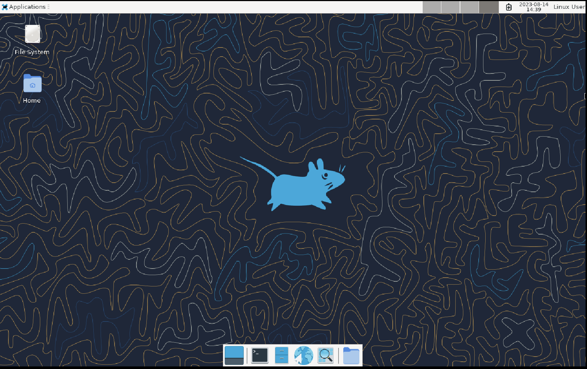

# GUI
> 참고: [How to install XFCE GUI on Alpine Linux
](https://linux.how2shout.com/how-to-install-xfce-gui-on-alpine-linux/)

나는 그냥 CLI 환경에서 과제를 진행하려 했으나..? 과제에 대해 조언을 구한 멤버 분으로부터 브라우저를 이용해야 한다는 평가 항목이 있다는 얘기를 들었다. 그래서 급하게 GUI를 추가했다.



짠!

## 세팅 과정
```shell
# 윈도우 시스템 디스플레이 서버(Xorg) 설치
setup-xorg-base

# 경량 데스크탑 환경인 XFCE 설치
apk add xfce4 xfce4-terminal xfce4-screensaver lightdm-gtk-greeter

# dbus(;desktop bus) 서비스 시작
rc-service dbus start

# 부트 시, 자동으로 서비스 시작
rc-update add dbus

# 부트 시, 자동으로 display manager 시작
rc-update add lightdm

# display manager 수동 시작
rc-service lightdm start
```

## chrome 설치
> 참고: [How to Install Google Chrome on Alpine Linux
](https://linuxhint.com/install-google-chrome-alpine-linux/)

```shell
# 크롬 설치
apk add chromium
```


화면 맨 밑 메뉴에서 지구본 모양 클릭 후 chromium 선택

만약 I/O Error로 실행 실패했다면, 재시작 후 다시 실행
