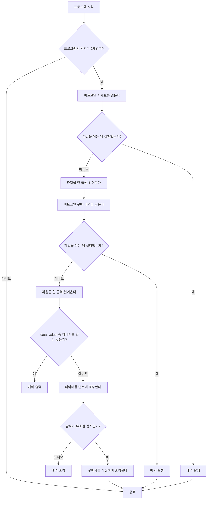

# CPP Module 09
## 과제를 통해 배울 수 있는 것
이번 과제에서는 STL을 활용하여 요구사항을 충족하는 프로그램을 만들어야 한다. 한 번 사용한 STL은 다른 문제(exercise)에서 사용할 수 없기 때문에 여러 STL을 상황에 맞게 적절히 이용해야 한다.

## Exercise 00: Bitcoin Exchange
비트코인 시세표에 따라 특정 일에 구매한 비트코인의 가격을 출력하면 되는 문제다. 프로그램에 반드시 적용해야 할 규칙은 아래와 같다.

- 프로그램의 이름은 `btc`이다.
- 프로그램은 인자로 파일 한 개를 받는다.
- 파일 내 각 라인은 `date | value`의 형식을 따른다.
- 유효한 날짜는 `Year-Month-Day`의 형식을 따른다.
- 유효한 값은 `0 <= x <= 1000`(x는 `float` 또는 양의 정수)이다.

해당 내용에 따라 대충 플로우 차트를 그려봤다.



실제 코드는 양이 좀 돼서 여기에 적긴 뭐하고 어떤 STL을 어떻게 썼는지만 적도록 하겠다.

비트코인 시세표를 담는 `Database` 클래스에는 `map`을 사용했고, 비트코인 구매 내역을 담는 `BitcoinExchange` 클래스에는 `multimap`을 사용했다.

시세표에는 어차피 중복된 값이 없는, 이미 검증이 끝난 데이터가 들어올 것이라 가정했기 때문에 키 값이 중복될 리가 없다고 판단했다. 그래서 `map`을 사용했다.  
구매 내역에는 하루에 여러 번 비트코인을 구매할 수 있으니 하나의 키 값에 여러 값을 담을 수 있는 `multimap`을 선택하여 구현했다.

## Exercise 01: Reverse Polish Notation
이번에는 `RPN`이라는 프로그램을 만드는 문제다. `RPN`이 뭐냐면 후위표기법과 같은 말이다. 예전에 학교다닐 때 시험에 나왔었는데...

하지만 그때보다는 기준이 많이 완화됐는데, 괄호까지는 구현하지 않아도 된다!

후위표기법하면 생각나는 자료구조가 있는데, 바로 스택이다. 스택은 뭐다? STL 컨테이너다. 그러면 이 과제는 `std::stack`을 이용해서 구현하면 되는 문제다.

```cpp
int RPN::calculate(std::string token) {
  std::stack<int> token_stack = this->getTokenStack();
  if (token_stack.size() < 2)
    throw std::invalid_argument("Error: Invalid expression.");
  int result = 0;
  int a = token_stack.top();
  token_stack.pop();
  int b = token_stack.top();
  token_stack.pop();

  if (token == "+")
    result = b + a;
  else if (token == "-")
    result = b - a;
  else if (token == "*")
    result = b * a;
  else if (token == "/") {
    if (a == 0)
      throw std::invalid_argument("Error: Division by zero.");
    result = b / a;
  }
  token_stack.push(result);
  this->setTokenStack(token_stack);
  return result;
}
```

division by zero 나 이상한 거 집어 넣었을 때, 연산하기엔 숫자가 부족할 때만 예외처리 해주면 되는 문제였다.

## Exercise 02: PmergeMe
> 참고: [Merge-insertion sort
: wikipedia](https://en.wikipedia.org/wiki/Merge-insertion_sort)

앞의 문제가 쉬운 이유가 있었다.  
이번 문제는 `PmergeMe`라는 프로그램을 작성하는 것으로, merge-insert 정렬 알고리즘을 써야 한다고 한다.

위의 문서를 해석해보자면 다음과 같다.

1. 집합 `X`의 요소를 n/2개의 쌍으로 묶는다. 요소의 개수가 홀수라면 남는 하나는 그대로 냅둔다.
2. 각 쌍에서 더 큰 숫자(`L`이라고 하겠다)끼리 비교한다.
3. `L`을 기준으로 각 쌍들을 재귀를 이용하여 오름차순으로 정렬(`S`라고 하겠다)한다.
4. `S`의 맨 첫번째 부분에 가장 작은 `L`이 속한 쌍의 작은 숫자를 집어넣는다.
5. 남은 각 쌍마다의 작은 숫자를 이진 탐색을 이용하여 `S` 내 적절한 위치에 집어넣는다.

자, 이제 이 순서대로 코드를 구현하면 된다. ~~참 쉽죠?~~

얘도 코드량이 좀 돼서 대신 깃허브 링크 하나 첨부하도록 하겠다.

<https://github.com/nyj001012/cpp09/tree/main/ex02>

이 문제를 푸는 데 사용한 정렬 알고리즘은 총 세 개로 병합 정렬, 삽입 정렬, 이진 탐색이다.

### 병합 정렬 (merge sort)
> [합병 정렬: 위키피디아](https://ko.wikipedia.org/wiki/%ED%95%A9%EB%B3%91_%EC%A0%95%EB%A0%AC)

위의 merge-insert 정렬 알고리즘의 3번 항목에 적용한 정렬 알고리즘이다.

#### 알고리즘
1. 정렬되지 않은 리스트를 각각 하나의 원소만 있는 n개의 부분 리스트로 분할한다.
2. 부분 리스트가 하나만 남을 때까지 반복해서 병합하며 정렬된 부분 리스트를 생성한다.

#### 구현
```c
/// merge sort range : [low ~ high]
void mergeSort(int A[], int low, int high, int B[]){
    // 1. base condition
    if(low >= high) return;

    // 2. divide
    int mid = (low + high) / 2;

    // 3. conquer
    mergeSort(A, low, mid, B);
    mergeSort(A, mid+1, high, B);

    // 4. combine
    int i=low, j=mid+1, k=low;
    for(;k<=high;++k){
        if(j > high ) B[k] = A[i++];
        else if(i > mid) B[k] = A[j++];
        else if(A[i] <= A[j]) B[k] = A[i++];
        else B[k] = A[j++];
    }

    // 5. copy
    for(i=low;i<=high;++i) A[i] = B[i];
}
```

### 삽입 정렬 (insertion sort)
### 이진 탐색 (binary search)
