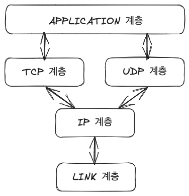

> 이 글은 [윤성우의 열혈 TCP/IP 소켓 프로그래밍(2010)](https://42library.kr/info/383)를 읽고 작성하였습니다.

~~집현전에 있으니까 빌려보는 것도 좋음!~~

- 일단 서브젝트 기반으로 필요해보이는 개념들을 정리하고, 실제로 유용했던 개념들에는 따로 ⭐️ 표시를 하겠다.

## 네트워크 프로그래밍과 소켓의 이해
### 소켓
- 프로그래밍에서 네트워크 망의 연결에 사용되는 도구. 의미를 조금 더 확장해서 두 컴퓨터의 연결을 의미하기도 한다

#### 소켓의 생성 과정
1. 소켓 생성
- `int socket(int domain, int type, int protocol);`: 성공 시 파일 디스크립터, 실패 시 -1 반환
2. IP 주소와 PORT 번호 할당
- `int bind(int sockfd, struct sockaddr *myaddr, socklen_t addrlen);`: 성공 시 0, 실패 시 -1 반환
3. 연결요청 가능상태로 변경
- `int listen(int sockfd, int backlog);`: 성공시 0, 실패 시 -1 반환
4. 연결요청에 대한 수락
- `int accept(int sockfd, struct sockaddr *addr, socklen_t *addrlen);`: 성공 시 파일 디스크립터, 실패 시 -1 반환

## 소켓의 타입과 프로토콜의 설정
### 프로토콜
- 컴퓨터 상호간의 대화에 필요한 통신규약

### 소켓 생성 함수, `socket()`
```cpp
#include <sys/socket.h>

int socket(int domain, int type, int protocol);
// 성공 시 파일 디스크립터, 실패 시 -1 반환
```

- `domain`: 소켓이 사용할 프로토콜 체계(Protocol Family) 정보 전달
- `type`: 소켓의 데이터 전송방식에 대한 정보 전달
- `protocol`: 두 컴퓨터간 통신에 사용되는 프로토콜 정보 전달

실제 소켓이 사용할 최종 프로토콜 정보는 `socket()` 함수의 인자 `protocol`을 통해 전달하도록 되어 있다.  
단, `domain`으로 지정한 프로토콜 체계의 범위 내에서 `protocol`의 값을 결정해야 한다.

### 프로토콜 체계(Protocol Family)
- 소켓이 사용할 프로토콜의 부류 정보 전달
- `sys/socket.h`에 선언

| 이름 | 프로토콜 체계(Protocol Family) |
|:----|:----------------------------|
| PF_INET | IPv4 인터넷 프로토콜 체계 |
| PF_INET6 | IPv6 인터넷 프로토콜 체계 |
| PF_LOCAL | 로컬 통신을 위한 UNIX 프로토콜 체계 |
| PF_PACKET | Low Level 소켓을 위한 프로토콜 체계 |
| PF_IPX | IPX 노벨 프로토콜 체계 |

### 소켓의 타입(Type)
- 소켓의 데이터 전송 방식
- 연결지향형, 비연결지향형 두 가지 종류가 있다.

#### 연결지향형 소켓(SOCK_STREAM)
- 중간에 데이터가 소멸되지 않고 목적지로 전송된다.
  - 소켓의 버퍼가 꽉 차더라도 데이터를 전송하는 영역의 소켓이 데이터를 전송하지 않기 때문에 데이터는 소멸되지 않고 재전송하기까지 한다.
- 전송 순서대로 데이터가 수신된다.
- 전송되는 데이터의 경계(Boundary)가 존재하지 않는다.
  - 데이터가 채워진 후에 한번의 read 함수 호출을 통해서 데이터 전부를 읽어 들일수도 있고, 한 번의 write 함수호출로 전송된 데이터 전부를 여러 번의 read 함수 호출을 통해서 읽어 들일수도 있다.
- 소켓 대 소켓의 연결은 반드시 1대 1이어야 한다

즉, 신뢰성 있는 순차적인 바이트 기반의 연결지향 데이터 전송 방식의 소켓

#### 비연결지향형 소켓(SOCK_DGRAM)
- 전송된 순서에 상관없이 가장 빠른 전송을 지향한다.
- 전송된 데이터는 손실의 우려가 있고, 파손의 우려가 있다.
- 전송되는 데이터의 경계(Boundary)가 존재한다.
- 택배 물건 두 개가 각각 별도의 오토바이에 실려서 목적지로 향하면, 물건을 받는 사람도 두 번에 걸쳐서 물건을 수령해야 한다.
- 한번에 전송할 수 있는 데이터의 크기가 제한된다.

즉, 신뢰성과 순차적 데이터 전송을 보장하지 않는, 고속의 데이터 전송을 목적으로 하는 소켓

### 사용 예시
IPv4 인터넷 프로토콜 체계에서 동작하는 연결지향형 데이터 전송 소켓
```cpp
int tcp_socket = socket(PF_INET, SOCK_STREAM, IPROTO_TCP);
```

## 주소체계와 데이터 정렬
### 구조체 `sockaddr_in`
```cpp
struct sockaddr_in
{
	sa_family_t    sin_family;  // 주소체계
	uint16_t       sin_port;    // 16비트 TCP/UDP PORT 번호
	struct in_addr sin_addr;    //32비트 IP 주소
	char           sin_zero[8]; // 사용되지 않음
}
```

- `sin_family`:
  | 주소체계(Address Family) | 의미 |
  |:-----------------------|:----|
  | AF_INET | IPv4 인터넷 프로토콜에 적용하는 주소체계 |
  | AF_INET6 | IPv6 인터넷 프로토콜에 적용하는 주소체계 |
  | AF_LOCAL | 로컬 통신을 위한 유닉스 프로토콜의 주소체계 |
- `sin_port`: 16비트 PORT번호를 네트워크 바이트 순서대로 저장
- `sin_addr`: 32비트 IP주소 정보를 저장
- `sin_zero`: 구조체 `sockaddr_in`의 크기를 구조체 `sockaddr`와 일치시키기 위해 삽입된 멤버로, 반드시 0으로 채워야 함

### 구조체 `in_addr`
```cpp
struct in_addr
{
	in_addr_t s_addr; // 32비트 IPv4 인터넷 주소
}
```

## 인터넷 주소의 초기화와 할당
### 문자열 정보를 네트워크 바이트 순서의 정수로 변환하기
```cpp
#include <arpa/inet.h>

in_addr_t inet_addr(const char *string);
// 성공 시 빅 엔디안으로 변환된 32비트 정수 값, 실패 시 INADDR_NONE 반환
```
- `string`: "211.214.107.99"와 같이 점이 찍힌 10진수로 표현된 문자열

```cpp
#include <arpa/inet.h>
int inet_aton(const char *string, struct in_addr *addr);
// 성공 시 1(true), 실패 시 0(false) 반환
```
- `string`: 변환할 IP주소 정보를 담고 있는 문자열의 주소 값
- `addr`: 변환된 정보를 저장할 `in_addr` 구조체 변수의 주소 값

```cpp
#include <arpa/inet.h>

char *inet_ntoa(struct in_addr adr);
// 성공 시 변환된 문자열의 주소 값, 실패 시 -1 반환
```
- `adr`: `in_addr` 구조체 변수
- 이 함수 호출 후에는 반환된 문자열 정보를 다른 메모리 공간에 복사해 두는 것이 좋다. 다시 한 번 이 함수를 호출하면, 전에 저장된 문자열 정보가 지워질 수 있다.

### 인터넷 주소의 초기화
```cpp
struct sockaddr_in addr;
char *serv_ip = "127.0.0.1";    // IP주소 문자열 선언
char *serv_port = "9190";       // PORT 번호 문자열 선언
memset(&addr, 0, sizeof(addr)); // 구조체 변수 addr의 모든 멤버 0으로 초기화
addr.sin_family = AF_INET;      // 주소체계 지정
addr.sin_addr.s_addr = inet_addr(serv_ip); // 문자열 기반의 IP주소 초기화
addr.sin_port = htons(atoi(serv_port));    // 문자열 기반의 PORT번호 초기화
```

#### INADDR_ANY
서버 소켓의 생성 과정에서 서버의 IP주소를 자동으로 할당한다.

```cpp
struct sockaddr_in addr;
char *serv_port = "9190";       // PORT 번호 문자열 선언
memset(&addr, 0, sizeof(addr)); // 구조체 변수 addr의 모든 멤버 0으로 초기화
addr.sin_family = AF_INET;      // 주소체계 지정
addr.sin_addr.s_addr = inet_addr(INADDR_ANY); // 문자열 기반의 IP주소 초기화
addr.sin_port = htons(atoi(serv_port));    // 문자열 기반의 PORT번호 초기화
```

### 소켓에 인터넷 주소를 할당하는 함수, `bind()`
```cpp
#include <sys/socket.h>

int bind(int sockfd, struct sockaddr *myaddr, socklen_t addrlen);
// 성공 시 0, 실패 시 -1 반환
```

- `sockfd`: 주소정보를(IP와 PORT를) 할당할 소켓의 파일 디스크립터
- `myaddr`: 할당하고자 하는 주소정보를 지니는 구조체 변수의 주소 값
- `addrlen`: 두 번째 인자로 전달된 구조체 변수의 길이정보

함수호출이 성공하면 `sockfd`에 해당하는 소켓에 `myaddr` 정보가 할당된다.

### 서버 소켓 초기화의 기본적인 코드 구성
```cpp
int serv_sock;
struct sockaddr_in serv_addr;
char *serv_port = "9190";

/* 서버 소켓(리스닝 소켓) 생성 */
serv_sock = socket(PF_INET, SOCK_STREAM, 0);

/* 주소정보 초기화 */
memset(&addr, 0, sizeof(serv_addr));
serv_addr.sin_family = AF_INET;
serv_addr.sin_addr.s_addr = htonl(INADDR_ANY);
serv_addr.sin_port = htons(atoi(serv_port));

/* 주소정보 할당 */
bind(serv_sock, (struct sockaddr *)&serv_addr, sizeof(serv_addr));
```

## TCP 기반 서버/클라이언트
### TCP/IP 프로토콜 스택


- LINK 계층: 네트워크 표준과 관련된 프로토콜을 정의하는 영역 (ex. 호스트 간의 물리적 연결)
- IP 계층: 데이터 전송 경로를 선택하는 영역
- TCP/UDP 계층(전송 계층): IP 계층에서 알려준 경로정보를 바탕으로 데이터의 실제 송수신을 담당
- APPLICATION 계층: 소켓을 이용해서 무언가를 만드는 과정에서 클라이언트와 서버간의 데이터 송수신에 대한 규약을 정하는 영역

### TCP 서버에서의 기본적인 함수호출 순서


### 연결요청 대기상태로의 진입, `listen()`
```cpp
#include <sys/socket.h>

int listen(int sock, int backlog);
// 성공 시 0, 실패 시 -1 반환
```

- `sock`: 연결요청 대기상태에 두고자 하는 소켓의 파일 디스크립터, 이는 서버 소켓(리스닝 소켓)이 됨
- `backlog`: 연결요청 대기 큐의 크기 정보로, 5로 지정하면 클라이언트의 연결요청을 5개까지 대기시킬 수 있음

### 클라이언트의 연결요청 수락, `accept()`
```cpp
#include <sys/socket.h>

int accept(int sock, struct sockaddr *addr, socklen_t *addrlen);
// 성공 시 생성된 소켓의 파일 디스크립터, 실패 시 -1 반환
```

- `sock`: 서버 소켓의 파일 디스크립터
- `addr`: 연결을 요청한 클라이언트의 주소 정보
- `addrlen`: `addr`에 전달된 주소의 변수 크기를 바이트 단위로 전달, 단 크기 정보를 변수에 저장한 다음에 변수의 주소 값을 전달

### TCP 기반 서버, 클라이언트의 함수호출 관계


## 소켓의 우아한 연결종료
## 소켓의 다양한 옵션
## 멀티프로세스 기반의 서버 구현
## 프로세스간 통신
## IO 멀티플렉싱
## 다양한 입출력 함수들
## 멀티캐스트 & 브로드캐스트
## 소켓과 표준 입출력
