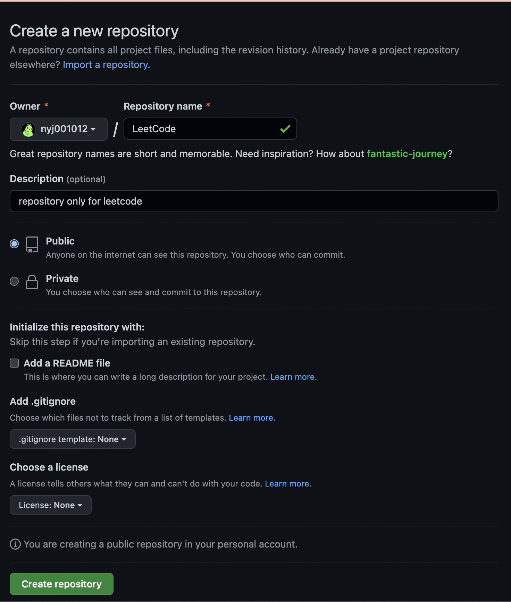

# LeetHub를 사용하려는 이유
LeetCode에서 문제를 풀고 나서 코드를 어디에서 관리해야할 지 고민이었다. 단순히 블로그에 코드를 박아 넣는 것도 방법이겠지만, 
뭔가 체계적으로 관리하고 싶었다. 그러던 중, 예에에에에ㅔㅔ전에 42서울 강의를 들었을 때, LeetHub를 지나가듯 들은 게 생각이 나서 
한 번 써보기로 했다.

# LeetHub 세팅
## LeetCode용 Repository 생성

우선 LeetCode를 위한 레포지토리를 하나 생성해주기로 했다. 따로 특별히 건드린 건 없다. 이름만 특정해서 새로 만들었다.

## Market Place에서 LeetHub 찾기

이후 깃허브의 마켓플레이스에 가서 LeetHub를 검색하면 해당 앱이 나온다. 'Set up a plan'을 클릭해서 다음으로 진행하자.  
참고로 LeetHub는 무료다.

## Set up a plan

'Install it for free'를 클릭하여 다음으로 진행하면

이름, 거주지, 도시, 국가 등의 개인 정보를 적는 공간이 나온다. 무료 어플임에도 불구하고 이런 정보를 요구하는 게 신기했는데, 아마 통계의 
목적으로 사용하지 않을까 싶다.  
대충 적절하게 적고 나서 'Save and continue'를 클릭한다.

'Complete order and begin installation'을 클릭하여 주문 작성(?)을 완료한다. 무료 어플인 건 알고 있지만, 뭔가 
긴장된다. ~~그리고 나 왜 yena로 나오지~~

주문 작성이 끝나면 크롬 확장 프로그램 페이지로 리다이렉트 된다. LeetHub 확장 프로그램 설치 페이지인데, 확장 프로그램에 추가하여 계속 
진행하면 된다.

그러면 확장 프로그램에 LeetHub 아이콘이 뜨는 걸 볼 수 있는데, 여기서 'Authenticate' 버튼을 클릭하여 아까 만든 깃허브 레포지토리를 
LeetHub에 연동한다.

버튼을 클릭하면 이런 페이지가 뜬다. 여기에 아까 만든 레포지토리의 이름을 적으면 된다. 여기에 뜬 오류 메시지는 내가 레포지토리 이름을 잘못 
써서 나온 메시지다...  
이름을 다 적었으면 'Get Started' 버튼을 클릭하여 세팅을 끝내자.

세팅이 끝나면, 확장 프로그램 창에서 사진과 같이 내가 몇 문제를 풀었는지 볼 수 있다. 레포지토리에 있는 코드를 기준으로 하기 때문에, 내가 여지껏 
풀었던 문제들은 반영이 되지 않은 상태이다. 이걸 옮겨놓는 작업도 해야겠다.

# 참고 링크
https://earth-95.tistory.com/88
