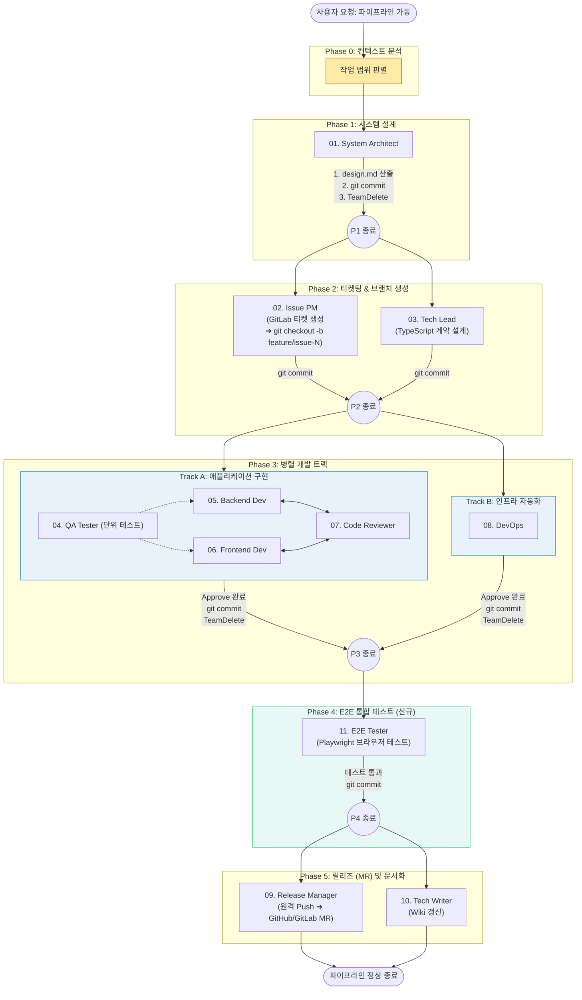

> 참고: [하네스 엔지니어링 with 클로드 코드](https://product.kyobobook.co.kr/detail/S000220048885)


# 왜 하네스 엔지니어링을 공부했나

경력이 짧음에도 불구하고 코드를 일일이 치기가 귀찮아졌다.  
설계가 재미있기도 하고, 오히려 그쪽이 인간이 할 만한 일이라고 생각해서 코드는 AI에게 맡기고 설계에 집중하고 싶었다.

그래서 요구사항을 분석하고 이슈를 만들고 브랜치를 파서 TDD로 작업을 하고 MR/PR을 날리는 파이프라인을 자동화하고 싶었다.  
클로드 코드를 회사에서 도입하기도 했고, 더 똑똑하게 클로드를 사용하고 싶어서 하네스 엔지니어링을 공부했다.

---

## 딸깍을 하기 위한 고생

> 
>
> *(하네스 설계 파일들)*
>
> 이걸 과연 딸깍이라고 할 수 있을까...

저 도서를 완독하고 실제로 연습을 하기 위해 [N-Queens 프로젝트](https://github.com/nyj001012/n-queens)를 생성하여 하네스를 도입해보기로 했다.  
하네스에서 에이전트의 구성은 총 11개인데, 내용은 리포지토리에 있으니 참고하면 된다.

하네스 설계는 아이디어와 초안을 내가 내고, 실제 파일로 구성하는 것은 제미나이의 도움을 받았다.  
하네스를 구성하고 든 생각은 "이게 과연 딸깍이 맞나"였다.  
각 에이전트 팀이 소통하기 위한 방안을 고안하고 어떤 파이프라인으로 작업을 수행할지 생각할 거리가 많았다.  
그래서 사람들이 생각하는 "딸깍" 한 번에 사이트가 만들어지게 하려면 오히려 엔지니어링에 대한 깊은 지식이 필요할 것 같았다.  
그래서 요즘 아키텍처나 설계 공부를 많이 하고 있다.

### 최종 파이프라인



---

### 실행했던 프롬프트

```
현재 프로젝트 루트에 있는 .claude의 _workspace 폴더에 requirements.md가 있어. 이걸 바탕으로 개발을 시작해줘. 백엔드가 필요 없는 앱이므로 반드시 run_pipeline 스킬을 호출하되, Phase 0에서 [프론트엔드 단독 (FE-only)] 경로로 라우팅해서 파이프라인을 가동해줘.
```

풀스택을 염두에 두고 만든 하네스였는데, 막상 프론트엔드만으로도 충분히 커버가 되는 프로젝트라 아쉽긴 했다.  
다음엔 데브옵스까지 한 번에 커버 가능한 프로젝트를 구상해서 해봐야겠다.

---

## 하네스 엔지니어링 후기

하네스를 도입하고 모든 파이프라인을 "딸깍" 하게 되면서 개발 속도가 미친듯이 올라갔다.  
단순 AI와 상호작용하며 코드를 작성하는 것보다 결과물도 깔끔하고 생산성이 월등히 높았다.  
또한 접근할 수 있는 경계를 명확히 하여 이상한 행동을 하는 빈도가 줄었다.

안타까운 점이라면 토큰 사용량이 모자랐다.  
모델을 저 팀 중 딱 3팀에게만 opus를 주고 나머진 sonnet을 줬는데, 저 사이트를 만든 후 약간의 다른 작업을 하니 일일 사용량 제한에 걸렸다.  
회사에서 pro를 사용 중인데 max가 간절해지는 순간이었다.  
지금은 이슈를 만들고 mr/pr을 만드는 팀에 haiku를 적용한 상태다.

---

## 마치며

하네스 엔지니어링은 내가 꿈꿔오던, 어찌 보면 개발 자동화의 꽃이기도 하다.  
이 과정에서 온전히 설계에 집중할 수 있었고, 그 부분이 제일 마음에 들었다.  
그리고 지금 이 블로그 글은 codex에 하네스 엔지니어링을 적용하여 포스팅 될 것이다.  
기회가 된다면 이 과정을 나눠보고 싶은데 컨퍼런스 나가볼까나...
