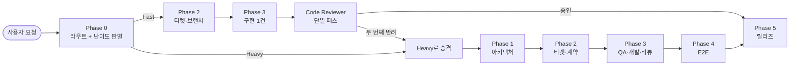

> 이전 글: [왜 하네스 엔지니어링을 공부했나](/etc/why-i-studied-harness-engineering/)
>
> 구현 저장소: [claude-harness-fullstack](https://github.com/nyj001012/claude-harness-fullstack)

# 풀스택 하네스 파이프라인의 토큰 소모 줄이기

이전 글의 마지막에는 하네스를 적용하니 개발 속도와 결과물은 만족스러웠지만, 토큰 사용량 때문에 일일 제한에 걸렸다고 적었다.
처음에는 비싼 모델을 싼 모델로 바꾸면 해결될 거라 생각했다. 실제로 이슈 생성, 브랜치 생성처럼 정해진 절차를 수행하는 `issue-pm`은 [Sonnet에서 Haiku로 내렸다](https://github.com/nyj001012/claude-harness-fullstack/issues/4).

그런데 모델만 낮추는 것으로는 충분하지 않았다.
더 큰 문제는 **작업이 아무리 작아도 같은 수의 에이전트와 같은 페이즈가 실행되고, 같은 문서를 여러 번 읽고, 필요 이상의 결과를 다음 컨텍스트로 넘기는 구조**였다.

결국 토큰을 줄이려면 모델의 단가보다 먼저 파이프라인이 토큰을 쓰는 방식을 봐야 했다.

---

## 어디에서 토큰을 낭비하고 있었나

기존 파이프라인의 낭비는 크게 네 종류였다.

1. 설계에 의존하는 에이전트를 스폰할 때마다 같은 `design.md`를 다시 읽었다.
2. 오케스트레이터가 판단에 필요하지 않은 문서 전문과 실행 로그까지 컨텍스트에 담았다.
3. 주석 한 줄을 고칠 때도 설계, 계약, QA 핑퐁, E2E, 문서화가 모두 실행됐다.
4. 일부 에이전트는 몇 줄만 바꾸면 되는 파일을 통째로 다시 출력했다.

이 네 가지는 모두 "필요한 작업을 더 싼 모델에게 맡기는 문제"가 아니었다.
**이미 아는 내용을 다시 읽고, 필요하지 않은 역할을 깨우고, 다음 판단에 필요하지 않은 내용까지 전달하는 문제**였다.

---

## 반복해서 읽던 설계서를 시스템 프롬프트에 주입하기

원래 하위 에이전트는 작업을 시작한 뒤 `Read`로 `design.md`를 조회했다. 이러면 에이전트를 스폰할 때마다 도구 왕복이 한 번 이상 추가되고, 같은 설계 전문이 매번 대화 중간에 들어간다.

[PR #3](https://github.com/nyj001012/claude-harness-fullstack/pull/3)에서는 이 구조를 바꿨다. 파이프라인이 시작되기 전에 `design.md`를 각 에이전트 정의 파일의 시스템 프롬프트 최상단에 정적으로 주입했다.

| 구분 | 런타임 `Read` | 정적 주입 |
|---|---|---|
| 설계서 위치 | 대화 중간의 도구 결과 | 시스템 프롬프트의 불변 접두사 |
| 스폰당 추가 왕복 | 1회 이상 | 없음 |
| 스폰 간 재사용 | 어려움 | 프롬프트 캐시를 활용할 수 있음 |
| 조회 누락 | 가능 | 항상 전문이 포함됨 |

여기서 중요한 점은 설계서를 짧게 줄인 것이 아니다.
**어차피 모두가 알아야 하는 긴 정보라면 매번 읽히지 말고, 캐시 가능한 위치에 한 번 배치한다**는 접근이었다.

설계가 바뀌었는지는 SHA-256 지문으로 확인한다. 에이전트가 최종 보고에 `DESIGN_FINGERPRINT`를 반환하고, 오케스트레이터가 현재 지문과 비교한다. 캐시를 노리면서도 낡은 설계로 작업하는 문제는 별도로 막은 셈이다.

---

## 오케스트레이터는 전문이 아니라 판정만 받기

정적 주입을 했는데도 오케스트레이터는 Phase 0에서 `design.md` 전문을 직접 읽고 있었다. 실제로 필요한 것은 기술 스택, 디렉터리 소유권, 표준 명령어 같은 필수 섹션이 채워졌는지에 대한 판정뿐이었다.

그래서 [이슈 #6](https://github.com/nyj001012/claude-harness-fullstack/issues/6)에서 `--sections` 검사를 추가했다.

```bash
node .claude/tools/inject-design.mjs --sections
```

스크립트가 필수 섹션의 존재와 본문 유무를 검사하고, 오케스트레이터에는 성공 여부와 미충족 섹션 이름만 돌려준다. 설계서 본문은 출력하지 않는다. 긴 문서를 읽고 "문제없음" 한 줄을 만드는 일을 LLM이 아니라 코드에 맡긴 것이다.

페이즈 사이의 상태 전달도 같은 원칙을 적용했다. [이슈 #10](https://github.com/nyj001012/claude-harness-fullstack/issues/10)에서 `_workspace/handoff/phase-N.md` 인계 파일을 도입하고 다음 페이즈에 필요한 사실만 남겼다.

- 최대 40줄 또는 2KB
- 설계서나 소스 본문 대신 파일 경로만 기록
- 재개할 때는 가장 최근 인계 파일 하나만 조회
- 브랜치, 이슈 번호, 커밋, 산출물, 미해결 항목, 다음 진입 조건만 보존

목표는 컨텍스트를 억지로 잘라내는 것이 아니었다.
**auto-compact나 세션 재시작으로 대화가 사라져도, 넓은 파일 탐색 없이 이어갈 수 있는 구조**를 만드는 것이었다.

---

## 팀이 많다고 항상 좋은 것은 아니었다

처음에는 여러 에이전트를 팀으로 묶어두는 쪽이 좋아 보였다. 하지만 teammate는 작업이 끝나도 팀 리소스로 살아 있고 종료 절차가 필요하다. P2P 메시지는 발신자와 수신자의 턴을 모두 소비한다.

실제로 P2P가 필요한 구간은 QA, Developer, Reviewer가 반려와 수정을 반복하는 Phase 3 Track A뿐이었다. 그래서 [팀 모드를 이 구간으로 한정](https://github.com/nyj001012/claude-harness-fullstack/issues/14)하고, 나머지는 작업 후 최종 보고만 남기고 종료하는 서브 에이전트로 바꿨다. 뒤이어 [실제로 존재하지 않거나 이미 종료된 수신자에게 보내던 메시지](https://github.com/nyj001012/claude-harness-fullstack/issues/16)도 제거했다.

또 하네스 자체를 수정하는 작업에는 애플리케이션의 `design.md`가 필요하지 않다. [하네스 메타 라우트](https://github.com/nyj001012/claude-harness-fullstack/issues/20)를 따로 두어 이 경우에는 설계 주입과 스택 검사를 생략했다. 이후 루트의 `README.md`, `package.json`, 배포 스크립트까지 문맥에 맞게 판별하도록 [라우팅 기준도 보완](https://github.com/nyj001012/claude-harness-fullstack/issues/34)했다.

이 작업들로 **필요한 통신만 남기고, 이미 종료된 역할이나 현재 작업과 무관한 명세를 다시 부르는 비용**을 없앴다.

---

## 핵심: 작업 크기에 따라 파이프라인의 두께를 바꾸기

가장 큰 변경은 [이슈 #38](https://github.com/nyj001012/claude-harness-fullstack/issues/38)이었다. 실제 변경은 [PR #39](https://github.com/nyj001012/claude-harness-fullstack/pull/39)에 반영됐다.

기존 Phase 0은 Full, FE-only, BE-only처럼 **어느 경로로 갈지**만 판별했다. 작업의 난이도는 보지 않았다. 그 결과 주석 한 줄이나 로직 한 줄을 수정해도 계약을 만들고, QA와 개발자가 핑퐁하고, E2E를 실행하고, 문서를 갱신했다.

파이프라인의 품질 게이트는 튼튼했지만 비용이 작업 크기와 무관하게 고정돼 있었다. 그리고 실제 작업은 작은 수정이 훨씬 많다. 작은 낭비가 매번 반복되니 누적 토큰의 대부분을 차지했다.

그래서 라우트와 별개로 **난이도 축**을 추가했다.

| 구분 | Fast | Heavy |
|---|---|---|
| 조건 | 대상 파일이 확정된 소수이고 계약·스키마·공개 인터페이스·의존성을 바꾸지 않음 | 그 밖의 모든 작업 |
| 수행 | Phase 0 → 2(티켓·브랜치) → 3(구현 1건 + 리뷰 1패스) → 5 | Phase 0 → 1 → 2 → 3 → 4 → 5 |
| 생략 | 아키텍처 설계, 계약 설계, QA 핑퐁, E2E | 없음 |



Fast라고 해서 검증을 전부 버리지는 않았다. 설계 명세 주입과 읽기 전용 `code-reviewer` 단일 패스는 남겼다. 리뷰는 전체 파이프라인에서 비교적 싼 게이트이면서 국소 변경의 실수를 잡을 수 있기 때문이다.

대신 두 번째 반려가 나오면 Fast 판정이 틀렸다는 신호로 보고 Heavy로 승격한다. 처음부터 완벽한 난이도 분류기를 만드는 대신, 실행 중 얻은 신호로 안전한 경로에 합류시킨다.

또 애매하면 Heavy로 보낸다. Heavy를 Fast로 잘못 분류하면 QA와 E2E 없이 구현물이 나가지만, Fast를 Heavy로 잘못 분류하면 토큰을 더 쓰는 것으로 끝난다. 두 오분류의 비용이 다르므로 품질 쪽으로 편향했다.

난이도 판정만 하는 전용 에이전트도 만들지 않았다. 오케스트레이터는 이미 사용자 요청을 알고 있다. 에이전트를 하나 더 스폰하면 **이미 아는 결론을 다시 사는 것**이 된다. 대상 파일을 모를 때만 Haiku 스카우트가 경로 탐색을 맡고, Fast/Heavy 판단은 오케스트레이터가 직접 한다.

---

## 실패 로그를 전부 읽지 말고 담당자만 다시 부르기

Heavy 트랙의 E2E가 실패하면 또 다른 낭비가 생겼다. 긴 로그 전문이 오케스트레이터 컨텍스트에 들어와 auto-compact를 앞당겼고, 누구를 다시 투입할지 정해진 규칙이 없어 매번 새로 추론했다.

이슈 #38에서는 `e2e-tester`의 반환 형식을 고정했다.

```text
[E2E FAILED]
area: fe | be | data | infra | unknown
failing: 실패한 시나리오
evidence: 로그 말미 최대 50줄
repro: 재현 절차
scope: 영향 범위
artifacts: 관련 산출물 경로
```

오케스트레이터는 `area`를 보고 해당 역할만 다시 스폰한다. 프론트엔드 실패라면 `frontend-developer`, 데이터 문제라면 `db-engineer`만 부른다. 로그 전문이 더 필요하면 오케스트레이터가 직접 읽지 않고 `e2e-tester`에게 근거를 보강하도록 요청한다.

여기서 재미있었던 점은 **판정 필드 하나가 리더 조직도를 대신했다**는 것이다. 처음 검토했던 리더 3명과 멤버 9명의 스쿼드는 채택하지 않았다. 새 에이전트 타입마다 별도의 시스템 프롬프트 접두사가 생겨 캐시 미스를 새로 부담하고, P2P 메시지 턴도 늘어나기 때문이다. 게다가 UI, 스타일, 이벤트처럼 같은 파일을 만지는 역할을 억지로 나누면 마지막 병합에서 다시 직렬화된다.

반면 `db-engineer`는 새로 분리했다. 스키마, 마이그레이션, 시드는 백엔드 API와 파일 트리도 다르고 검수 규칙도 달라 실제 이음선이었기 때문이다. 토큰 최적화는 무조건 에이전트 수를 줄이는 일이 아니다. **겹치는 역할은 합치고, 독립적으로 끝낼 수 있는 경계만 나누는 일**에 더 가깝다.

---

## 몇 줄을 고치기 위해 파일 전체를 다시 쓰지 않기

이슈 #38을 적용한 뒤에는 출력 토큰도 손봤다. [이슈 #40](https://github.com/nyj001012/claude-harness-fullstack/issues/40)과 [PR #41](https://github.com/nyj001012/claude-harness-fullstack/pull/41)을 확인해보니 일부 에이전트에는 `Edit`가 있어도 대응 스킬의 `allowed-tools`에는 없었다. 스킬이 활성화되면 도구 집합이 좁아져 결국 `Write`로 파일 전체를 다시 작성했다.

400줄짜리 파일에 10줄을 추가한다고 가정하면 전체 재작성은 약 4,000 출력 토큰, 부분 수정은 약 150 토큰이었다. 리뷰 핑퐁이 세 번이면 이 차이도 세 번 반복된다.

그래서 에이전트와 스킬 양쪽의 도구 선언을 맞추고 다음 규칙을 추가했다.

> 기존 파일의 부분 수정은 `Edit`, `Write`는 신규 파일 생성에만 사용한다.

이 변경은 토큰만의 문제도 아니었다. 전체 재작성은 모델이 재현하지 못한 주석이나 무관한 코드를 조용히 없앨 수 있고, diff를 파일 전체로 부풀려 리뷰어가 실제 변경을 찾기 어렵게 만든다. 출력 토큰을 줄이면서 가장 싼 품질 게이트인 코드 리뷰도 더 잘 작동하게 됐다.

---

## 실제 비교: 토큰 사용량 30.1% 절감

같은 작업을 Fast와 Heavy 트랙으로 각각 실행한 결과는 다음과 같았다.

| 트랙 | 페이즈 | 역할 | 토큰 | 툴 호출 | 소요시간 |
|---|---|---|---:|---:|---:|
| Fast | Phase 3 구현 | `devops-engineer` | 210,947 | 111 | 20.6분 |
| Fast | Phase 3 리뷰 | `code-reviewer` 단일 패스 | 74,281 | 22 | 4.4분 |
| **Fast 합계** |  |  | **285,228** | **133** | **24.9분** |
| Heavy | Phase 2 계약 설계 | `tech-leader` | 126,407 | 36 | 13.2분 |
| Heavy | Phase 3 구현 | `devops-engineer` | 167,007 | 91 | 17.4분 |
| Heavy | Phase 3 리뷰 | `code-reviewer` | 114,587 | 15 | 1.8분 |
| **Heavy 합계** |  |  | **408,001** | **142** | **32.4분** |
| **차이 (Heavy − Fast)** |  |  | **122,773 절감 (30.1%)** | **9회 감소 (6.3%)** | **7.5분 단축 (23.1%)** |

> 페이즈별 소요시간은 소수 첫째 자리로 반올림해, 원본 실행 기록으로 계산한 Fast 합계와 표시된 행의 합 사이에 0.1분 차이가 있다.

결과적으로 Fast 트랙은 같은 작업에서 Heavy보다 토큰을 **122,773개**, 비율로는 **30.1%** 적게 사용했다. 툴 호출은 6.3%, 소요시간은 23.1% 줄었다.

눈에 띄는 점은 Fast의 구현 단계만 떼어 보면 오히려 Heavy보다 토큰과 툴 호출이 많았다는 것이다. Fast의 `devops-engineer`는 210,947토큰을 사용했고, Heavy에서는 167,007토큰을 사용했다. 즉 Fast가 항상 각 에이전트를 더 싸게 실행해주는 것은 아니다.

표에 기록된 전체 비용이 줄어든 가장 큰 이유는 Heavy에만 있던 `tech-leader`의 계약 설계 126,407토큰이 Fast에서는 통째로 사라졌기 때문이다. 리뷰 비용도 40,306토큰 줄었다. **개별 에이전트의 효율이 좋아졌다기보다, 이 작업에 필요하지 않은 페이즈를 실행하지 않은 효과가 더 컸다.**

툴 호출은 6.3%만 줄었는데 토큰은 30.1% 줄었다는 점도 같은 사실을 보여준다. 호출 횟수만 세는 것으로는 파이프라인 비용을 제대로 설명하기 어렵다. 어떤 역할을 스폰했는지, 그 역할이 얼마나 긴 컨텍스트를 받았는지까지 함께 봐야 한다.

물론 이 결과는 한 작업을 두 트랙으로 실행한 비교이므로 모든 작업에서 항상 30.1%가 절감된다고 일반화할 수는 없다. 작업 유형별로 표본을 더 모으고 입력·출력·캐시 토큰을 나눠 측정하는 일은 여전히 남아 있다. 다만 적어도 **작은 작업에도 Heavy의 고정 비용을 지불하고 있었다**는 가설은 실제 수치로 확인할 수 있었다.

---

## 마치며

처음에는 좋은 하네스란 모든 작업에 가장 엄격한 절차를 적용하는 것이라고 생각했다. 하지만 그렇게 만든 파이프라인은 작은 작업에도 큰 작업의 비용을 청구했다.

지금은 좋은 하네스를 이렇게 생각한다.

> 필요한 품질 게이트는 남기되, 작업의 크기만큼만 비용을 지불하게 만드는 것.

모델을 Haiku로 바꾸는 것도 도움이 되지만, 그보다 먼저 해야 할 일은 불필요한 턴을 만들지 않고, 같은 정보를 다시 읽지 않고, 긴 결과를 다음 컨텍스트에 그대로 넘기지 않는 것이다.

결국 토큰 최적화도 하네스 엔지니어링이었다.
AI에게 일을 덜 시킨 것이 아니라, **필요한 일만 시키도록 파이프라인을 다시 설계한 것**이었다.
