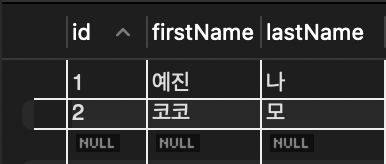

# ORM
## ORM 이란
- ORM(Object Relational Mapping; 객체 관계 매핑)은 뜻 그대로 **객체와 데이터베이스의 관계를 매핑**해주는 역할을 한다.  
- 즉, 객체와 관계형 데이터베이스(RDBMS; Relational Database Management System)의 데이터를 **자동으로 매핑**해준다.  
- 또한 **MVC 패턴에서 모델을 기술**한다.
- ORM Framework: TypeORM(Type script), MyBatis/Hibernate(Java), Sequelize(Node.js)

## ORM을 써야 하는 이유, 장점
- 객체 지향적이기 때문에, 더 직관적이고 비즈니스 로직에 더 집중할 수 있게 해준다.
  - SQL 선언문, 할당, 종료 같은 부수적인 코드가 없거나 상당히 줄일 수 있다.
  - 각종 객체에 대한 코드를 별도로 작성하기 때문에 코드의 가독성을 올려준다.
  - 객체 지향적 접근으로 생산성이 증가한다.

- 재사용 및 유지보수의 편리성이 증가한다.
  - ORM은 기존 객체와 독립적인 객체로 취급되어 해당 객체를 재활용할 수 있다.
  - 따라서 MVC 패턴에 유리하다.

- DBMS와의 종속성을 줄일 수 있다.
  - 스키마의 변경이라든가 극단적으로 DBMS를 교체하는 거대한 작업에도 비교적 적은 리스크와 시간이 소요된다.

## ORM의 단점
- 완벽한 ORM만으로는 서비스를 구현하기 어렵다.
  - 사용하기엔 편하지만, 설계는 신중하게 해야 한다.
  - 프로젝트의 복잡성이 커지면, 설계의 난이도는 증가할 가능성이 있다.
  - 잘못 구현하면 성능이 떨어지거나 일관성이 깨질 수 있다.
  - 자주 사용되는 큰 규모의 쿼리는 속도를 위해 저장 프로시저를 쓰는 등, 별도의 튜닝이 필요할 수 있다.

- 프로시저가 많은 시스템에서는 ORM의 장점을 활용하기 어렵다.
  - 프로시저가 많을수록 객체로 변환하는 과정에서 생산성 저하나 리스크가 많이 발생할 수 있다.

# Type Script: TypeORM
> 공식 문서: <https://typeorm.io/>

## Getting Started 번역
[원문 보기](https://typeorm.io/)

TypeORM은 NodeJS, Browser, Cordova, PhoneGap, Ionic, React Native, NativeScript, Expo 및 전자 플랫폼에서 동작 가능하고 TypeScript와 JavaScript (ES5, ES6, ES7, ES8)에서 사용 가능한 ORM 입니다. 목표는 최신 Javascript를 항상 지원하고, 몇 안 되는 테이블을 가진 작은 프로그램부터 다수의 데이터베이스를 가진 대규모 기업용 프로그램까지 데이터베이스를 사용하는 어떠한 종류의 프로그램이라도 개발할 수 있게끔 도와주는 부가적인 부분까지 지원하는 것입니다.

TypeORM은 현재 존재하는 다른 모든 JavaScript ORM들과는 다르게, [Active Record 패턴과 Data Mapper 패턴](https://velog.io/@koreanhole/Active-Record%ED%8C%A8%ED%84%B4%EA%B3%BC-Data-Mapper-%ED%8C%A8%ED%84%B4) 모두를 지원합니다. 이는 **높은 퀄리티의, 느슨하게 연결된, 확장 가능한, 지속 가능한 프로그램을 가장 생산적인 방식으로 작성**할 수 있음을 의미합니다.

## Example using TypeORM with Express
패키지 매니저로 **yarn**을, DBMS로 **MySQL2**를 기준으로 **express**를 사용하여 튜토리얼을 진행하도록 하겠다. 특별히 이와 같이 구성한 이유는 
내가 현재 42 서울에서 활동하고 있는 집현전에서 위와 같은 세팅으로 개발을 하고 있기 때문이다.

### 초기 설정
우선 프로젝트 폴더에 yarn을 설치하고, `package.json`을 생성, 이후 타입 스크립트를 설치했다.
```bash
brew install yarn
yarn init -y
yarn add typescript --save-dev
```

타입 스크립트 설치까지 끝났으면, 타입 스크립트를 초기화하는 명령어를 실행하여 설정 파일인 `tsconfig.json`을 생성한다.
```bash
tsc -init
```

그러면 이와 같은 메시지가 터미널에 출력되고, 타입 스크립트 설정 파일이 생성된다.

```bash
Created a new tsconfig.json with:                                                                                       
                                                                                                                     TS 
  target: es2016
  module: commonjs
  strict: true
  esModuleInterop: true
  skipLibCheck: true
  forceConsistentCasingInFileNames: true


You can learn more at https://aka.ms/tsconfig
```

이후 `tsconfig.json`의 파일 내용 중, 나는 `compilerOptions` 중에 튜토리얼과는 다르게 일부만 변경했다.

```json
{
    "compilerOptions": {
        ...
        "emitDecoratorMetadata": true,
        "experimentalDecorators": true
        ...
    }
}
```

저 속성들은 처음엔 주석 처리가 되어 있을 건데, 저걸 true로 안 해주면 나중에 `@Entity` 같은 TypeORM의 [데코레이터](https://m.blog.naver.com/pjt3591oo/222120496022)를 
쓸 때 에러가 난다. 그래서 다른 건 몰라도 저 둘만큼은 꼭 true로 변경하기!

이제 타입 스크립트의 `src`폴더와 `app.ts`파일을 생성한다. 직접 폴더와 파일을 만들어도 되고, 아니면 밑에 터미녈 명령어를 실행하자.

```bash
mkdir src
touch src/app.ts
```

그리고 아까 만든 `src/app.ts`에 아래와 같은 코드를 추가하고 직접 실행해볼 것이다.

```ts
console.log("Application is up and running :)");
```

`src/app.ts`에 코드를 다 작성했으면 해당 파일을 자바 스크립트 파일로 컴파일한다.
```bash
tsc
```
컴파일하면 `src/app.js`가 생성된다. 이렇게 컴파일된 자바 스크립트 파일을 아래의 명령어로 실행한다. 그 결과로 아까 `src/app.ts`에 작성한 
"Application is up and running :)"이 출력되면 정상적으로 동작한 것이다.

```bash
node src/app.js
```

### Adding Express to the application
이제 TypeORM과 타입 스크립트의 준비가 되었으니 `express`를 프로젝트에 추가해보도록 하겠다. 일단 express를 아래의 명령어로 설치한다.

```bash
yarn add express @types/express --save
```

- `express`: express 엔진. 웹 API를 작성할 수 있게 해준다.
- `@types/express`: express의 타입 정의에 대한 패키지이다.

이제 `src/app.ts`에 express 스타일의 로직을 아래와 같이 구현해보자.

```ts
import express from "express"
import { Request, Response } from "express"

// create and setup express app
const app = express()
app.use(express.json())

// register routes

app.get("/users", function (req: Request, res: Response) {
    // here we will have logic to return all users
})

app.get("/users/:id", function (req: Request, res: Response) {
    // here we will have logic to return user by id
})

app.post("/users", function (req: Request, res: Response) {
    // here we will have logic to save a user
})

app.put("/users/:id", function (req: Request, res: Response) {
    // here we will have logic to update a user by a given user id
})

app.delete("/users/:id", function (req: Request, res: Response) {
    // here we will have logic to delete a user by a given user id
})

// start express server
app.listen(3000)
```

이제 프로젝트를 컴파일하고 실행해보면 된다. express 서버로 라우팅도 할 수 있다. 그런데, 전부 아무것도 반환하지는 않는다.

### Adding TypeORM to the application
이번엔 TypeORM을 추가해보자. 위에서 적어놨듯 튜토리얼에서는 mysql을 사용했지만, 나는 `mysql2`를 사용하여 진행하도록 하겠다. 튜토리얼에서도 다른 드라이버들도 셋업 
프로세스는 비슷하다고 나와있다.

아래의 명령어를 실행하여 typeorm, mysql2를 설치하자.

```bash
yarn add typeorm mysql2 reflect-metadata --save
```

- `reflect-metadata`: 데코레이터가 적절히 동작하게 한다.

다 설치했으면 초기 데이터베이스 연결 옵션을 설정하는 역할인 `app-data-source.ts` 를 작성하자.

```ts
import { DataSource } from "typeorm"

export const myDataSource = new DataSource({
    type: "mysql", // mysql2도 type을 mysql로 지정한다.
    host: "localhost",
    port: 3306,
    username: "ormtest",
    password: "password",
    database: "test",
    entities: ["src/entity/*.js"],
    logging: true,
    synchronize: true,
})
```

> [더 많은 Data Source Option 보러가기](https://typeorm.io/data-source-options#)

그 다음으로 `src/entity`에 `user.entity.ts`라는 엔티티 파일을 작성하자.

```ts
import { Entity, Column, PrimaryGeneratedColumn } from "typeorm"

@Entity()
export class User {
    @PrimaryGeneratedColumn()
    id!: number

    @Column()
    firstName!: string

    @Column()
    lastName!: string
}
```

이때 튜토리얼 대로 작성하면 `속성 'id'은(는) 이니셜라이저가 없고 생성자에 할당되어 있지 않습니다.ts(2564)`라는 에러가 발생하는 경우가 있다. 
생성자를 추가해주면 해당 에러를 없앨 수 있지만, 간단하게 `!` 연산자를 추가하여 **해당 변수에는 무조건 값이 있음을 보장**한다고 
표시해주면 이 방법도 에러를 없앨 수 있다. 대신 남용하는 것은 좋지 않을 것 같다...

엔티티 파일까지 전부 작성했으면 `src/app.ts`를 CRUD에 맞게 아래와 같이 작성한다. 참고로 공식 문서의 튜토리얼에서 
일부를 수정했기 때문에, 공식 문서에서 제시한 코드와는 약간 다르다.

```typescript
import express from "express"
import { Request, Response } from "express"
import { User } from "./entity/user.entity"
import { myDataSource } from "../app-data-source"

// establish database connection
myDataSource
    .initialize()
    .then(() => {
        console.log("Data Source has been initialized!")
    })
    .catch((err) => {
        console.error("Error during Data Source initialization:", err)
    });

// create and setup express app
const app = express();
app.use(express.json());

// register routes
import express from "express"
import { Request, Response } from "express"
import { User } from "./entity/user.entity"
import { myDataSource } from "../app-data-source"

// 데이터베이스 연결
myDataSource
	.initialize()
	.then(() => {
		console.log("Data Source has been initialized!")
	})
	.catch((err) => {
		console.error("Error during Data Source initialization:", err)
	});

// express 생성 및 설정
const app = express();
app.use(express.json());

// 라우터
app.get("/users", async function (req: Request, res: Response) {
	const users = await myDataSource.getRepository(User).find();
	res.json(users);
});

app.get("/users/:id", async function (req: Request, res: Response) {
	const results = await myDataSource.getRepository(User).findOneBy({
		id: Number(req.params.id),
	});
	return res.send(results);
})

app.get("/user/register", async function (req: Request, res: Response) {
	const myRepo = myDataSource.getRepository(User);
	const user = await myRepo.create([
		{
			"firstName": "user",
			"lastName": "new"
		},
		{
			"firstName": "chicken",
			"lastName": "breast"
		}
	]);
	console.log(user);
	const results = await myRepo.save(user);
	return res.send(results);
})

app.get("/users/update/:id", async function (req: Request, res: Response) {
	const user = await myDataSource.getRepository(User).findOneBy({
		id: Number(req.params.id),
	});
	if (user) {
		myDataSource.getRepository(User).merge(user, { "firstName": "Lover" },
													 { "lastName": "Espresso" });
		const results = await myDataSource.getRepository(User).save(user);
		return res.send(results);
	}
	else
		return res.statusMessage = 'Getting Repository Failed';
})

app.get("/users/leave/:id", async function (req: Request, res: Response) {
	const results = await myDataSource.getRepository(User).delete(req.params.id);
	return res.send(results);
})

// start express server
app.listen(3000);
```

자, 위처럼 파일을 작성하고 서버를 돌려보면 아무것도 안 나올 것이다! 왜냐하면 데이터베이스를 만들지 않았기 때문이다.  
튜토리얼 페이지에서는 따로 데이터베이스를 만드는 부분을 생략했는데, 나는 이 부분까지 함께 작성하도록 하겠다.

### 데이터베이스 구성: MySQL2
여기서 필요한 데이터베이스는 `user`라는 테이블로, 컬럼들은 `src/entity/user.entity.ts`의 내용을 토대로 생성할 것이다.  
컬럼은 순서대로

- id: INT, PK
- firstName: CHAR
- lastName: CHAR

이다. 이를 SQL문으로 작성하면 아래와 같다.

```sql
CREATE TABLE user (
    id INT AUTO_INCREMENT PRIMARY KEY NOT NULL,
    firstName NCHAR(10) NOT NULL,
    lastName NCHAR(2) NOT NULL
);
```
(사실 SQL 안 쓰고 워크벤치에서 GUI 써서 생성해도 되기는 한다)

그리고 데이터를 아래와 같이 넣어주도록 하겠다.

```sql
INSERT INTO user (firstName, lastName)
VALUES ('예진', '나');
INSERT INTO user (firstName, lastName)
VALUES ('코코', '모');
```

이제 `SELECT`문을 이용하여 `user` 테이블에 값이 잘 들어갔는지를 확인하도록 하겠다.

```sql
SELECT * FROM user;
```

{: width="40%"}

이후 `node src/app.js` 명령어를 터미널에 입력하여 실행하면 터미널에 아래와 같은 메시지가 출력된다.

```bash
~/dev/TypeORM_Tutorial/with_express ❯ node src/app.js

query: SELECT VERSION() AS `version`
query: START TRANSACTION
query: SELECT DATABASE() AS `db_name`
query: SELECT `TABLE_SCHEMA`, `TABLE_NAME` FROM `INFORMATION_SCHEMA`.`TABLES` WHERE `TABLE_SCHEMA` = 'test' AND `TABLE_NAME` = 'user'
query: 
                SELECT
                    *
                FROM
                    `INFORMATION_SCHEMA`.`COLUMNS`
                WHERE
                    `TABLE_SCHEMA` = 'test'
                    AND
                    `TABLE_NAME` = 'user'
... (중략) ...
query: COMMIT
Data Source has been initialized!
```

`Data Source has been initialized!`라는 문구가 출력되면, 데이터베이스와의 연결이 성공했다는 뜻이다!

### 핵심 함수와 실행 화면 및 생성된 쿼리문
이번에는 각 라우터에 따라 어떤 결과가 나오는지를 확인해보자. 라우터마다 조회, 삽입, 수정, 삭제 동작을 하게 했는데, 
해당 동작에 어떤 함수가 쓰였는지를 적었다. 그리고 각 라우터마다의 실행 화면과 그에 따라 생성된 쿼리문이 터미널에 어떻게 출력되었는지를 정리하였다.

#### `find()`: 한 테이블의 전체 조회 결과 가져오기
- 사용 라우터: `/users`

- 실행 화면


생성된 쿼리문
```bash
query: SELECT `User`.`id` AS `User_id`, `User`.`firstName` AS `User_firstName`, `User`.`lastName` AS `User_lastName` FROM `user` `User`
```

#### `findOneBy()`: 한 테이블의 조회 결과 1개 행만 가져오기
- 사용 라우터: `/users/:id`
- 실행 화면

- 생성된 쿼리문
```bash
query: SELECT `User`.`id` AS `User_id`, `User`.`firstName` AS `User_firstName`, `User`.`lastName` AS `User_lastName` FROM `user` `User` WHERE (`User`.`id` = ?) LIMIT 1 -- PARAMETERS: [2]
```
참고로 `LIMIT 1`이 자동으로 들어간 이유는 해당 라우터 내의 `findOneBy()`함수 때문이다. 해당 함수는 한 개의 결과만 가져오는 역할을 한다(자세한 내용은 공식 문서의 [Query Builder](https://typeorm.io/select-query-builder) 파트를 참고하자).

#### `save()`: 데이터베이스에 엔티티가 없다면 엔티티 추가, 존재하는 엔티티라면 업데이트
- 사용 라우터: `/users/register`
- 실행 화면

- 생성된 쿼리문

#### `merge()`: 여러 엔티티를 하나의 엔티티로 합친다.
- 사용 라우터: `/users/update/:id`
- 실행 화면
- 생성된 쿼리문

#### `delete()`: 주어진 조건에 맞는 엔티티를 삭제한다.
- 사용 라우터: `/users/leave/:id`
- 실행 화면
- 생성된 쿼리문

# 참고 자료
- [ORM](#orm)
  - [[데이터베이스] ORM이란? (Node.js ORM Lib Sequelize 소개)
](https://hanamon.kr/orm%EC%9D%B4%EB%9E%80-nodejs-lib-sequelize-%EC%86%8C%EA%B0%9C/)
  - [ORM](http://www.incodom.kr/ORM)
  - [ORM(Object Relational Mapping)](https://changrea.io/jpa/orm/)
- [TypeORM](#type-script-typeorm)
  - [Data Source](https://typeorm.io/data-source)
  - [Entity](https://typeorm.io/entities)
  - [Entity Manager](https://typeorm.io/working-with-entity-manager)
  - [Query Builder](https://typeorm.io/select-query-builder)
  - [TypeORM gitbook](https://orkhan.gitbook.io/typeorm/): 함수 설명이 공식 문서에는 없을 때 참고
