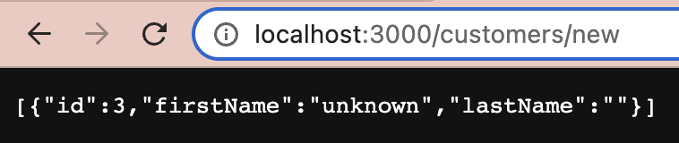

# ORM
## ORM 이란
- ORM(Object Relational Mapping; 객체 관계 매핑)은 뜻 그대로 **객체와 데이터베이스의 관계를 매핑**해주는 역할을 한다.  
- 즉, 객체와 관계형 데이터베이스(RDBMS; Relational Database Management System)의 데이터를 **자동으로 매핑**해준다.  
- 또한 **MVC 패턴에서 모델을 기술**한다.
- ORM Framework: TypeORM(Type script), MyBatis/Hibernate(Java), Sequelize(Node.js)

## ORM을 써야 하는 이유, 장점
- 객체 지향적이기 때문에, 더 직관적이고 비즈니스 로직에 더 집중할 수 있게 해준다.
  - SQL 선언문, 할당, 종료 같은 부수적인 코드가 없거나 상당히 줄일 수 있다.
  - 각종 객체에 대한 코드를 별도로 작성하기 때문에 코드의 가독성을 올려준다.
  - 객체 지향적 접근으로 생산성이 증가한다.

- 재사용 및 유지보수의 편리성이 증가한다.
  - ORM은 기존 객체와 독립적인 객체로 취급되어 해당 객체를 재활용할 수 있다.
  - 따라서 MVC 패턴에 유리하다.

- DBMS와의 종속성을 줄일 수 있다.
  - 스키마의 변경이라든가 극단적으로 DBMS를 교체하는 거대한 작업에도 비교적 적은 리스크와 시간이 소요된다.

## ORM의 단점
- 완벽한 ORM만으로는 서비스를 구현하기 어렵다.
  - 사용하기엔 편하지만, 설계는 신중하게 해야 한다.
  - 프로젝트의 복잡성이 커지면, 설계의 난이도는 증가할 가능성이 있다.
  - 잘못 구현하면 성능이 떨어지거나 일관성이 깨질 수 있다.
  - 자주 사용되는 큰 규모의 쿼리는 속도를 위해 저장 프로시저를 쓰는 등, 별도의 튜닝이 필요할 수 있다.

- 프로시저가 많은 시스템에서는 ORM의 장점을 활용하기 어렵다.
  - 프로시저가 많을수록 객체로 변환하는 과정에서 생산성 저하나 리스크가 많이 발생할 수 있다.

# Type Script: TypeORM
> 공식 문서: <https://typeorm.io/>

## Getting Started 번역
[원문 보기](https://typeorm.io/)

TypeORM은 NodeJS, Browser, Cordova, PhoneGap, Ionic, React Native, NativeScript, Expo 및 전자 플랫폼에서 동작 가능하고 TypeScript와 JavaScript (ES5, ES6, ES7, ES8)에서 사용 가능한 ORM 입니다. 목표는 최신 Javascript를 항상 지원하고, 몇 안 되는 테이블을 가진 작은 프로그램부터 다수의 데이터베이스를 가진 대규모 기업용 프로그램까지 데이터베이스를 사용하는 어떠한 종류의 프로그램이라도 개발할 수 있게끔 도와주는 부가적인 부분까지 지원하는 것입니다.

TypeORM은 현재 존재하는 다른 모든 JavaScript ORM들과는 다르게, [Active Record 패턴과 Data Mapper 패턴](https://velog.io/@koreanhole/Active-Record%ED%8C%A8%ED%84%B4%EA%B3%BC-Data-Mapper-%ED%8C%A8%ED%84%B4) 모두를 지원합니다. 이는 **높은 퀄리티의, 느슨하게 연결된, 확장 가능한, 지속 가능한 프로그램을 가장 생산적인 방식으로 작성**할 수 있음을 의미합니다.

## Example using TypeORM with Express
패키지 매니저로 **yarn**을, DB로 **MySQL2**를, DBMS로 MySQL Workbench를, 그리고 **express**를 사용하여 튜토리얼을 진행하도록 하겠다. 특별히 이와 같이 구성한 이유는 
내가 현재 42 서울에서 활동하고 있는 집현전에서 위와 같은 세팅으로 개발을 하고 있기 때문이다.

### 초기 설정
우선 프로젝트 폴더에 yarn을 설치하고, `package.json`을 생성, 이후 타입 스크립트를 설치했다.
```bash
brew install yarn
yarn init -y
yarn add typescript --save-dev
```

타입 스크립트 설치까지 끝났으면, 타입 스크립트를 초기화하는 명령어를 실행하여 설정 파일인 `tsconfig.json`을 생성한다.
```bash
tsc -init
```

그러면 이와 같은 메시지가 터미널에 출력되고, 타입 스크립트 설정 파일이 생성된다.

```bash
Created a new tsconfig.json with:                                                                                       
                                                                                                                     TS 
  target: es2016
  module: commonjs
  strict: true
  esModuleInterop: true
  skipLibCheck: true
  forceConsistentCasingInFileNames: true


You can learn more at https://aka.ms/tsconfig
```

이후 `tsconfig.json`의 파일 내용 중, 나는 `compilerOptions` 중에 튜토리얼과는 다르게 일부만 변경했다.

```json
{
    "compilerOptions": {
        ...
        "emitDecoratorMetadata": true,
        "experimentalDecorators": true
        ...
    }
}
```

저 속성들은 처음엔 주석 처리가 되어 있을 건데, 저걸 true로 안 해주면 나중에 `@Entity` 같은 TypeORM의 [데코레이터](https://m.blog.naver.com/pjt3591oo/222120496022)를 
쓸 때 에러가 난다. 그래서 다른 건 몰라도 저 둘만큼은 꼭 true로 변경하기!

이제 타입 스크립트의 `src`폴더와 `app.ts`파일을 생성한다. 직접 폴더와 파일을 만들어도 되고, 아니면 밑에 있는 터미널 명령어를 실행하자.

```bash
mkdir src
touch src/app.ts
```

그리고 아까 만든 `src/app.ts`에 아래와 같은 코드를 추가하고 직접 실행해볼 것이다.

```ts
console.log("Application is up and running :)");
```

`src/app.ts`에 코드를 다 작성했으면 해당 파일을 자바 스크립트 파일로 컴파일한다.
```bash
tsc
```
컴파일하면 `src/app.js`가 생성된다. 이렇게 컴파일된 자바 스크립트 파일을 아래의 명령어로 실행한다. 그 결과로 아까 `src/app.ts`에 작성한 
"Application is up and running :)"이 출력되면 정상적으로 동작한 것이다.

```bash
node src/app.js
```

### Adding Express to the application
이제 TypeORM과 타입 스크립트의 준비가 되었으니 `express`를 프로젝트에 추가해보도록 하겠다. 일단 express를 아래의 명령어로 설치한다.

```bash
yarn add express @types/express --save
```

- `express`: express 엔진. 웹 API를 작성할 수 있게 해준다.
- `@types/express`: express의 타입 정의에 대한 패키지이다.

이제 `src/app.ts`에 express 스타일의 로직을 아래와 같이 구현해보자.

```ts
import express from "express"
import { Request, Response } from "express"

// create and setup express app
const app = express()
app.use(express.json())

// register routes

app.get("/users", function (req: Request, res: Response) {
    // here we will have logic to return all users
})

app.get("/users/:id", function (req: Request, res: Response) {
    // here we will have logic to return user by id
})

app.post("/users", function (req: Request, res: Response) {
    // here we will have logic to save a user
})

app.put("/users/:id", function (req: Request, res: Response) {
    // here we will have logic to update a user by a given user id
})

app.delete("/users/:id", function (req: Request, res: Response) {
    // here we will have logic to delete a user by a given user id
})

// start express server
app.listen(3000)
```

이제 프로젝트를 컴파일하고 실행해보면 된다. express 서버로 라우팅도 할 수 있다. 그런데, 전부 아무것도 반환하지는 않는다.

### Adding TypeORM to the application
이번엔 TypeORM을 추가해보자. 위에서 적어놨듯 튜토리얼에서는 mysql을 사용했지만, 나는 `mysql2`를 사용하여 진행하도록 하겠다. 튜토리얼에서도 다른 드라이버들도 셋업 
프로세스는 비슷하다고 나와있다.

아래의 명령어를 실행하여 typeorm, mysql2를 설치하자.

```bash
yarn add typeorm mysql2 reflect-metadata --save
```

- `reflect-metadata`: 데코레이터가 적절히 동작하게 한다.

다 설치했으면 초기 데이터베이스 연결 옵션을 설정하는 역할인 `app-data-source.ts` 를 작성하자.

```ts
import { DataSource } from "typeorm"

export const myDataSource = new DataSource({
    type: "mysql", // mysql2도 type을 mysql로 지정한다.
    host: "localhost",
    port: 3306,
    username: "ormtest",
    password: "password",
    database: "test",
    entities: ["src/entity/*.js"],
    logging: true,
    synchronize: true,
})
```

> [더 많은 Data Source Option 보러가기](https://typeorm.io/data-source-options#)

그 다음으로 `src/entity`에 `user.entity.ts`라는 엔티티 파일을 작성하자.

```ts
import { Entity, Column, PrimaryGeneratedColumn } from "typeorm"

@Entity()
export class User {
    @PrimaryGeneratedColumn()
    id!: number

    @Column()
    firstName!: string

    @Column()
    lastName!: string
}
```

이때 튜토리얼 대로 작성하면 `속성 'id'은(는) 이니셜라이저가 없고 생성자에 할당되어 있지 않습니다.ts(2564)`라는 에러가 발생하는 경우가 있다. 
생성자를 추가해주면 해당 에러를 없앨 수 있지만, 간단하게 `!` 연산자를 추가하여 **해당 변수에는 무조건 값이 있음을 보장**한다고 
표시해주면 이 방법도 에러를 없앨 수 있다. 대신 남용하는 것은 좋지 않을 것 같다...

엔티티 파일까지 전부 작성했으면 `src/app.ts`를 CRUD에 맞게 아래와 같이 작성한다. 참고로 공식 문서의 튜토리얼에서 
일부를 수정했기 때문에, 공식 문서에서 제시한 코드와는 약간 다르다.

```typescript
import express from "express"
import { Request, Response } from "express"
import { User } from "./entity/user.entity"
import { myDataSource } from "../app-data-source"

// 데이터베이스 연결
myDataSource
	.initialize()
	.then(() => {
		console.log("Data Source has been initialized!")
	})
	.catch((err) => {
		console.error("Error during Data Source initialization:", err)
	});

// express 생성 및 설정
const app = express();
app.use(express.json());

// 라우터
app.get("/users/register", async function (req: Request, res: Response) {
	const myRepo = myDataSource.getRepository(User);
	const user = await myRepo.create([
		{
			firstName: "이름",
			lastName: "성"
		},
		{
			firstName: "glish",
			lastName: "En"
		}
	]);
	const results = await myRepo.save(user);
	return res.json(results);
});

app.get("/users/update/:id", async function (req: Request, res: Response) {
	const user = await myDataSource.getRepository(User).findOneBy({
		id: Number(req.params.id),
	});
	if (user) {
		myDataSource.getRepository(User).merge(user, { "firstName": "Lover" },
		{ "lastName": "Espresso" });
		const results = await myDataSource.getRepository(User).save(user);
		return res.send(results);
	}
	else
		return res.statusMessage = 'Getting Repository Failed';
});

app.get("/users/leave/:id", async function (req: Request, res: Response) {
	const results = await myDataSource.getRepository(User).delete(req.params.id);
	return res.send(results);
});

app.get("/users/:id", async function (req: Request, res: Response) {
	const results = await myDataSource.getRepository(User).findOneBy({
		id: Number(req.params.id),
	});
	return res.send(results);
});

app.get("/users", async function (req: Request, res: Response) {
	const users = await myDataSource.getRepository(User).find();
	res.json(users);
});

// start express server
app.listen(3000);

```

자, 위처럼 파일을 작성하고 서버를 돌려보면 아무것도 안 나올 것이다! 왜냐하면 데이터베이스를 만들지 않았기 때문이다.  
튜토리얼 페이지에서는 따로 데이터베이스를 만드는 부분을 생략했는데, 나는 이 부분까지 함께 작성하도록 하겠다.

### 데이터베이스 구성: MySQL2
여기서 필요한 데이터베이스는 `user`라는 테이블로, 컬럼들은 `src/entity/user.entity.ts`의 내용을 토대로 생성할 것이다.  
컬럼은 순서대로

- id: INT, PK
- firstName: CHAR
- lastName: CHAR

이다. 이를 SQL문으로 작성하면 아래와 같다.

```sql
CREATE TABLE user (
    id INT AUTO_INCREMENT PRIMARY KEY NOT NULL,
    firstName NCHAR(10) NOT NULL,
    lastName NCHAR(2) NOT NULL
);
```
(사실 SQL 안 쓰고 워크벤치에서 GUI 써서 생성해도 되기는 한다)

그리고 데이터를 아래와 같이 넣어주도록 하겠다.

```sql
INSERT INTO user (firstName, lastName)
VALUES ('예진', '나');
INSERT INTO user (firstName, lastName)
VALUES ('코코', '모');
```

이제 `SELECT`문을 이용하여 `user` 테이블에 값이 잘 들어갔는지를 확인하도록 하겠다.

```sql
SELECT * FROM user;
```

{: width="45%"}

이후 `node src/app.js` 명령어를 터미널에 입력하여 실행하면 터미널에 아래와 같은 메시지가 출력된다.

```bash
~/dev/TypeORM_Tutorial/with_express ❯ node src/app.js

query: SELECT VERSION() AS `version`
query: START TRANSACTION
query: SELECT DATABASE() AS `db_name`
query: SELECT `TABLE_SCHEMA`, `TABLE_NAME` FROM `INFORMATION_SCHEMA`.`TABLES` WHERE `TABLE_SCHEMA` = 'test' AND `TABLE_NAME` = 'user'
query: 
                SELECT
                    *
                FROM
                    `INFORMATION_SCHEMA`.`COLUMNS`
                WHERE
                    `TABLE_SCHEMA` = 'test'
                    AND
                    `TABLE_NAME` = 'user'
... (중략) ...
query: COMMIT
Data Source has been initialized!
```

`Data Source has been initialized!`라는 문구가 출력되면, 데이터베이스와의 연결이 성공했다는 뜻이다!

### 핵심 함수와 실행 화면 및 생성된 쿼리문
이번에는 각 라우터에 따라 어떤 결과가 나오는지를 확인해보자. 라우터마다 조회, 삽입, 수정, 삭제 동작을 하게 했는데, 
해당 동작에 어떤 함수가 쓰였는지를 적었다. 그리고 각 라우터마다의 실행 화면과 그에 따라 생성된 쿼리문이 터미널에 어떻게 출력되었는지를 정리하였다.

#### `find()`: 한 테이블의 전체 조회 결과 가져오기
- 사용 라우터: `/users`

- 실행 화면  
{: width="80%"}

- 생성된 쿼리문
```bash
query: SELECT `User`.`id` AS `User_id`, `User`.`firstName` AS `User_firstName`, `User`.`lastName` AS `User_lastName` FROM `user` `User`
```

#### `findOneBy()`: 한 테이블의 조회 결과 1개 행만 가져오기
- 사용 라우터: `/users/:id`

- 실행 화면  
{: width="45%"}

- 생성된 쿼리문
```bash
query: SELECT `User`.`id` AS `User_id`, `User`.`firstName` AS `User_firstName`, `User`.`lastName` AS `User_lastName` FROM `user` `User` WHERE (`User`.`id` = ?) LIMIT 1 -- PARAMETERS: [2]
```
참고로 `LIMIT 1`이 자동으로 들어간 이유는 해당 라우터 내의 `findOneBy()`함수 때문이다. 해당 함수는 한 개의 결과만 가져오는 역할을 한다(자세한 내용은 공식 문서의 [Query Builder](https://typeorm.io/select-query-builder) 파트를 참고하자).

#### `create()`: 새로운 인스턴스를 생성한다.
- 사용 라우터: `/users/register`

- 실행 화면  
{: width="80%"}

- 생성된 쿼리문
```bash
query: START TRANSACTION
query: INSERT INTO `user`(`id`, `firstName`, `lastName`) VALUES (DEFAULT, ?, ?) -- PARAMETERS: ["이름","성"]
query: INSERT INTO `user`(`id`, `firstName`, `lastName`) VALUES (DEFAULT, ?, ?) -- PARAMETERS: ["glish","En"]
query: COMMIT
```

사실 `insert()`를 써서 같은 동작을 하도록 만들 수 있다. 그리고 신기한 점은 그냥 깡으로 insert를 할 줄 알았는데, 트랜잭션 처리를 한다는 점이었다. 그렇다면 rollback 함수도 있으려나 싶어서 찾아봤는데, `beforeTransactionRollback()`, `afterTransactionRollback()` 등의 트랜잭션 관련 콜백 함수를 재정의하여 사용할 수 있었다. 이것도 나중에 잘 사용하면 매우 유용할 것 같다.

#### `merge()`: 여러 엔티티를 하나의 엔티티로 합친다.
- 사용 라우터: `/users/update/:id`

- 실행 화면  
{: width="45%"}

- 생성된 쿼리문
```bash
query: START TRANSACTION
query: UPDATE `user` SET `firstName` = ?, `lastName` = ? WHERE `id` IN (?) -- PARAMETERS: ["Lover","Espresso",1]
query: COMMIT
```

여기서 하나 특이한 점이 있다. 바로 내가 처음 `user` 테이블을 만들 때, 스키마를 정의하는 과정에서 firstName은 10글자, lastName은 2글자로 글자수 제한을 걸어뒀었다. 그런데 어떻게 그보다 더 긴 길이의 데이터가 insert 되었을까? 바로 `app-data-source.ts`에서 지정한 `synchronize: true` 속성 때문이다.  

`synchronize` 옵션은 어플리케이션을 작동할 때마다 데이터베이스 스키마를 자동으로 생성해야 할지를 결정한다. 그래서인지 공식문서에서는 디버그와 개발 중에는 유용하게 쓸 수 있지만, 상업용(in production)에서는 사용에 주의를 요한다고 적혀있다. 그 대안으로 CLI와 run schema:sync 커맨드를 쓸 수 있다고 한다.

그리고 데이터베이스를 확인해보니까 `synchronize: true` 속성에 의해 firstName과 lastName의 스키마에서 데이터 타입 부분이 전부 varchar(255)로 바뀌어있었다. 그런데 "/users/register" 에서는 칼같이 insert를 막았다. 아무래도 insert 명령으로는 스키마가 바뀌지 않도록 해놓은 듯 하다.

추가로 `synchronize: false`로 두고 위의 라우터를 실행하면 데이터가 너무 길다는 에러가 뜬다.

#### `delete()`: 주어진 조건에 맞는 엔티티를 삭제한다.
- 사용 라우터: `/users/leave/:id`

- 실행 화면  
{: width="45%"}

- 생성된 쿼리문
```bash
query: DELETE FROM `user` WHERE `id` IN (?) -- PARAMETERS: ["2"]
```

### Advanced: Using Query Builder
우선, TypeORM에서는 Repository API와 Query Builder를 이용하여 SQL을 구성할 수 있다. 그런데 "아니 Repository API 사용해서 동작 가능하게 만들었으면 됐지, 웬 Query Builder냐?" 할 수 있다. 이 둘은 명백한 차이가 있고, 각각의 특징이 있기 때문에 상황에 맞춰서 잘 사용하면 좋을 것 같아서 Repository 뿐만 아니라 Query Builder로도 어떻게 TypeORM을 사용하는지를 작성하도록 하겠다.

Query Builder를 이용하는 방법은 크게 DataSource, entity manager, repository를 이용한 방법이 있는데, repository를 이용하는 방법은 이미 해봤으니 이번엔 DataSource를 사용해보도록 하겠다.

#### Repository API vs Query Builder
- Repository API
  - 사용하기 쉬움
  - 릴레이션을 가져오는 데 친화적
    - 데코레이션으로부터 eager/lazy 릴레이션들이 파싱됨
    - join을 일일이 열거할 필요 없음
- Query Builder
  - 매우 강력하고 SQL문에 가까운 형태
  - 복잡한 SQL문도 구성 가능
  - join을 명시해야 함
    - 그렇지 않으면 메인 테이블의 내용만 가져옴

#### app.ts with DataSource + Query Builder
위에서 Repository API를 이용하여 만든 `app.ts`를 Query Builder를 이용한 코드로 바꾸면 다음과 같다.

```typescript
import express from "express"
import { Request, Response } from "express"
import { User } from "./entity/user.entity"
import { myDataSource } from "../app-data-source"

// 데이터베이스 연결
myDataSource
	.initialize()
	.then(() => {
		console.log("Data Source has been initialized!")
	})
	.catch((err) => {
		console.error("Error during Data Source initialization:", err)
	});

// express 생성 및 설정
const app = express();
app.use(express.json());

// 라우터
app.get("/users/register", async function (req: Request, res: Response) {
	const values = [
		{
			firstName: "이름",
			lastName: "성"
		},
		{
			firstName: "glish",
			lastName: "En"
		}
	];
	myDataSource.createQueryBuilder()
		.insert()
		.into(User)
		.values(values)
		.execute();
	return res.redirect("/users");
});

app.get("/users/update/:id", async function (req: Request, res: Response) {
	const id = req.params.id;
	myDataSource.createQueryBuilder()
		.update(User)
		.set({ "firstName": "Updated" })
		.where("id = :id", { id: id })
		.execute();
	return res.redirect("/users/" + id);
});

app.get("/users/leave/:id", async function (req: Request, res: Response) {
	await myDataSource.createQueryBuilder()
			.delete()
			.from(User)
			.where("id = :id", { id: req.params.id })
			.execute();
	return res.redirect("/users");
});

app.get("/users/count", async function (req: Request, res: Response) {
	const count = await myDataSource.createQueryBuilder()
					.select()
					.from(User, "user")
					.getCount();
	return res.json(count);
});

app.get("/users/:id", async function (req: Request, res: Response) {
	const name = await myDataSource.createQueryBuilder()
					.select(["user.firstName", "user.lastName"])
					.from(User, "user")
					.where("user.id = :id", { id: req.params.id })
					.getOne();
	return res.json(name);
});

app.get("/users", async function (req: Request, res: Response) {
	const users = await myDataSource.createQueryBuilder()
					.select()
					.from(User, "user")
					.orderBy("user.id", "DESC")
					.getRawMany();
	return res.json(users);
});

// start express server
app.listen(3000);

```

~~줄맞춤 악랄한 거 보소~~

여기서는 Repository API를 사용했을 때와 비슷한 동작을 하기 때문에, 실행 화면과 쿼리문은 건너뛰겠다. 대신 쓰인 함수에 대해서만 간략하게 적어놓도록 하겠다.

- `createQueryBuilder()`: SQL 쿼리를 구성하는 데 쓰이는 쿼리 builder를 생성한다.
- `select()`: SELECT문을 만든다. 괄호 안에는 함수(ADD, SUM 같은), 컬럼 등 일반적인 SELECT와 FROM 사이에 들어갈 수 있는 구문들이 들어갈 수 있다.
- `from()`: SELECT, DELETE문에서의 from 역할. 데이터를 매핑할 엔티티 클래스와 테이블의 별칭을 인자로 받는다.
- `where()`: WHERE 조건문 역할. 조건을 추가하고 싶으면 `andWhere()`나 `orWhere()`를 써도 된다.
- `orderBy()`: ORDER BY 역할. 정렬의 기준이 되는 컬럼과 정렬 방식을 인자로 받는다.
- `getRawMany()`: builder SQL을 실행하여 반환된 모든 raw result를 가져온다.
- `getOne()`: builder SQL을 실행하여 반환된 엔티티 한 개를 가져온다.
- `getCount()`: builder SQL을 실행하여 반환된 엔티티의 개수를 가져온다.
- `insert().into(Entity Class, columns).values(values)`: = INSERT INTO table (columns) VALUES (values)
- `update(Entity Class).set(values)`: = UPDATE table SET values
- `delete().from(Entity Class)`: = DELETE FROM table

### Advanced: JOIN
이왕 advanced인데, RDBMS의 꽃인 join을 빼놓으면 섭섭하지 않을까 싶어서 준비했다. 사실 나는 SQL문 작성하는 걸 좋아하는 편이고, 특히 join문 작성하는 걸 좋아한다. 뭔가 수수께끼 푸는 기분 들어서 재밌다.  

여튼쨌든 기존에 있던 user 테이블 말고, 테이블을 하나 더 만들어보자. 대충 주문 내역을 볼 수 있는 order 테이블을 만들어보도록 하겠다. 왜 하필 주문 내역이냐면, 내가 졸업작품 만들 때 쇼핑몰을 만든 기억이 있어서 그렇지, 별 뜻은 없다(tmi 대방출).  

쿼리문은 아래와 같다.

```sql
CREATE TABLE `order`(
	id INT AUTO_INCREMENT PRIMARY KEY NOT NULL,
    userId INT NOT NULL,
    item VARCHAR(14) NOT NULL,
    price INT NOT NULL,
    FOREIGN KEY (`userId`) REFERENCES `user` (`id`)
);
```
`order.userId`가 `user.id` 참조하게 하여 둘의 관계를 생성해주었다. 이렇게 하면 `order.userId`는 `user.id`에 있는 값만 들어갈 수 있다. 일종의 제약 조건(CONSTRAINTS)과 같다.

그리고 아래와 같이 order 테이블에 데이터를 넣어주었다.

```sql
INSERT INTO `order` (userId, item, price) VALUES (1, "cereal", 10000);
INSERT INTO `order` (userId, item, price) VALUES (2, "seed", 2000);
```
추가적으로 user 테이블에 3번 유저를 한 명 더 넣어주도록 하겠다.

```sql
INSERT INTO user (firstName, lastName) VALUES ("unknown", "10");
```

위의 SQL문들을 전부 실행한 이후의 order, user 테이블의 데이터는 다음과 같다.

{: width="40%"}
{: width="50%"}

추가적으로 내가 JOIN을 함으로써 가져올 엔티티의 속성은 주문번호(orderNo), 주문한 사람(orderer), 상품(item), 가격(price)이므로 이에 따라 엔티티를 새로 만들어주도록 하겠다.  
`src/entity/order.entity.ts`에 다음과 같이 작성한다.

```typescript
import { Entity, Column, PrimaryGeneratedColumn, JoinColumn, OneToMany, ManyToOne } from "typeorm";
import { User } from "./user.entity";

@Entity()
export class Order {
	@PrimaryGeneratedColumn()
	id: number

	@OneToMany(type => User, user => user.id)
	userId: number

	@Column()
	orderer: string

	@Column()
	item: string

	@Column()
	price: number
}
```

여기서 등장한 `@OneToMany`가 있는데, 이는 데이터베이스의 관계를 나타낸다. `order` 테이블 입장에서 `user.id`는 여러 개 입력될 수 있다. 즉, 한 사용자가 여러 주문을 넣을 수 있기 때문에 "1대 다"의 관계가 성립된다. 한 개의 `user.id`가 여러 `order` 테이블의 데이터를 가질 수 있다는 것이다.  
그리고 해당 데코레이터의 인자로 참조를 하는 엔티티(테이블)와 어떤 속성(테이블의 필드)을 참조하는지도 명시해준다.

#### INNER JOIN
INNER JOIN은 교집합 개념으로, ON 구문 뒤에 나오는 조건에 일치하면서 두 테이블에 데이터가 모두 있는 데이터만을 갖고 온다. 직접 SQL문을 보며 설명하도록 하겠다. 아래의 SQL문은 user 테이블과 order 테이블을 inner join하여 두 테이블에 있는 정보를 가져온다.

```sql
SELECT `order`.id as orderNo, 
        CONCAT(user.lastName, ' ', user.firstName) as orderer,
        `order`.item, 
        `order`.price
        FROM `order`
        INNER JOIN user
        ON user.id = `order`.userId;
```

`user`테이블과 `order`테이블을 `INNER JOIN`하는데, `user.id = order.userId`인 데이터들을 양쪽 테이블에서 가져온다. 즉, order와 user의 컬럼 중에 나는 `order.id`, `user.lastName, user.firstName`, `order.item`, `order.price`를 조회할 것이다.

중간중간 쓰인 `as`는 별칭이다. `order.id as orderNo`는 `order.id` 컬럼을 `orderNo`라고 부르겠다는 뜻이다.

`CONCAT()` 함수를 써서 성과 이름을 합쳐줬고, `orderer`라고 별칭을 붙였다.

위의 쿼리문을 실행하면 결과가 아래와 같이 나온다.


여기서 주목할 점은 `user` 테이블에 저장된 3번 유저의 데이터는 조회되지 않았다는 점이다. 왜냐하면 `ON user.id = order.userId` 조건에 걸렸기 때문이다.

##### INNER JOIN in TypeORM
이걸 TypeORM을 이용하여 JSON 형식으로 가져오도록 하겠다. `app.ts`를 다음과 같이 작성한다.

```typescript
import express from "express"
import { Request, Response } from "express"
import { User } from "./entity/user.entity"
import { myDataSource } from "../app-data-source"

// 데이터베이스 연결
myDataSource
    .initialize()
    .then(() => {
        console.log("Data Source has been initialized!")
    })
    .catch((err) => {
        console.error("Error during Data Source initialization:", err)
    });

// express 생성 및 설정
const app = express();
app.use(express.json());

// 라우터
app.get("/order", async function (req: Request, res: Response) {
    // INNER JOIN
    const orders = await myDataSource.createQueryBuilder("order", "o")
                                        .innerJoin("user", "u", "o.userId = u.id")
                                        .select(["o.id", "orderNo")
                                        .addSelect("CONCAT(u.lastName, ' ', u.firstName)", "orderer")
                                        .addSelect("o.item", "item")
                                        .addSelect("o.price", "price")
                                        .getRawMany();
    return res.json(orders);
});

// start express server
app.listen(3000);

```

여기서 주의깊게 봐야 할 점은 `innerJoin(테이블, 별칭, 조건)` 부분이다. 위에서 작성한 SQL문에서 `INNER JOIN user` 부분이 `innerJoin()`의 첫 번째 인자로 들어갔다. SQL문에서는 내가 따로 별칭을 정해주진 않았는데, query builder에서는 user 테이블을 u라고 부르겠다는 별칭을 두 번째 인자로 넣어줬다. 그리고 마지막 세 번째 인자로 SQL문 내의 `ON user.id = order.userId` 부분을 넘겨줬다.  
그러면 `createQueryBuilder()`와 `innerjoin()`에 의해 SQL문 상의 `FROM order INNER JOIN user ON user.id = order.userId`부분이 생성되었다.

이번에는 JOIN 결과에서 어떤 컬럼들을 SELECT 할 건지를 정해줄 차례이다. JOIN한 결과를 전부 그냥 가져올 생각이라면, `innerJoin()` 함수 대신 `innerJoinAndSelect()` 함수를 쓰면 바로 해결이 된다. 그런데 나는 `CONCAT()` 함수를 쓰면서 일부 컬럼만 가져올 것이기 때문에 `select()`함수로 조회할 컬럼을 지정해주었다.  
거기에 추가적으로 여러 컬럼을 더 조회하고 싶으면 `addSelect()` 함수를 써도 되고, 아니면 `select()`함수의 인자로 컬럼 명들을 리스트의 형태로 전달해도 된다. 개인적으로는 `addSelect()`가 더 가독성 좋은 것 같다. 별칭도 한 컬럼에 하나씩 볼 수 있기도 하고.

그리고 `SUM()`이라든가 집계 함수라든가 그런 데이터들을 조회할 때에는 `getRaw...()`함수를 써야 한다. 왜냐하면 엔티티가 아니라 raw 데이터로 분류되기 때문이다.

이제 앱 실행해서 `/order` 페이지에 접속해보면 아래와 같은 화면이 뜬다.


#### OUTER JOIN
INNER JOIN이 교집합이라면, OUTER JOIN은 합집합의 개념이다. OUTER JOIN은 LEFT OUTER JOIN, RIGHT OUTER JOIN으로 나뉘는데, 둘의 차이는 어떤 테이블을 중심으로 JOIN을 할 지에 있다.  
예시를 위해 위에서 지정했던 order-user 외래키 제약 조건을 잠시 해제한 이후에 진행하겠다.

```sql
SET FOREIGN_KEY_CHECKS = 0; // FOREIGN_KEY 제약 조건 임시 해제, 활성화 하려면 값 1
INSERT INTO `order`
	   (userId, price, item)
	   VALUES (4, 9999, "오류!"); 
```

이렇게 하면 user 테이블에 id가 4인 데이터가 없음에도 불구하고 `order`테이블에 위의 데이터가 정상적으로 들어간다.


이제 아래의 SQL문을 실행해보자. 먼저 `order` 테이블이 중점인 LEFT JOIN을 해보도록 하겠다.

```sql
SELECT * FROM `order` o
         LEFT OUTER JOIN user u
         ON o.userId = u.id;
```
이때 결과가 어떻게 나올까? 바로 아래와 같이 나온다.


세 번째 행을 보면 NULL 값이 들어있는 걸 볼 수 있다. 앞의 5개의 컬럼은 `order` 테이블에 입력된 값이지만, 뒤의 3개 컬럼은 `user` 테이블 내의 정보이다. 즉, **`order` 테이블에는 데이터가 있지만, `user` 테이블에는 데이터가 없어도 그 둘을 합쳐서 조회한다.**  
LEFT OUTER JOIN 일 때, OUTER JOIN이라는 글자를 기준으로 왼쪽에 있는 테이블(order)에는 데이터가 있고, 오른쪽에 있는 테이블(user)에는 데이터가 없더라도 그 값을 NULL로 채워서 가져온다고 생각하면 쉬울 것 같다.

그렇다면 반대로 RIGHT OUTER JOIN을 한다면 어떻게 될까? 예상컨대 `user` 테이블에만 데이터가 있고 `order` 테이블에는 데이터가 없는 경우, `order` 테이블의 값에 NULL이 채워진 결과가 나올 것이다.

```sql
SELECT * FROM `order` o
         RIGHT OUTER JOIN user u
         ON o.userId = u.id;
```


##### OUTER JOIN in TypeORM
사실 LEFT를 하든, RIGHT를 하든 함수 이름만 다를 것이기 때문에 특정 상황을 가정해서 OUTER JOIN을 TypeORM으로 구현해보도록 하겠다.  
예를 들어 내가 쇼핑몰을 운영하는데, 주문을 전혀 한 적이 없는 신규 고객에게만 쿠폰을 발급하기로 한다고 해보자. 그러면 나는 고객들의 주문 내역을 조회해야 할 것이다. 그 중에서도 주문 내역이 없는(NULL) 사용자만 골라내서 그 사용자에게만 쿠폰을 발급해야 할 것이다.  
주문 내역이 없는 사용자를 골라내기 위해서는 `user` 테이블과 `order` 테이블을 OUTER JOIN 해야 한다.

```sql
SELECT u.*
	   FROM user u
	   LEFT OUTER JOIN `order` o
	   ON o.userId = u.id
	   WHERE ISNULL(o.id) //o.id가 NULL인 것만!
```
위의 쿼리를 실행하면, 아래와 같은 데이터가 출력된다.


이 고객님의 lastName이 어디갔는지는 모르겠는데, 상관 없으니 그대로 진행하도록 하겠다. 이제 이 sql문이 정상적으로 동작하는 걸 확인했으니, TypeORM으로 작성해보도록 하겠다.  
아까 작성한 `app.ts`에 아래의 코드를 추가하도록 하자.

```typescript
app.get("/customers/new", async function (req: Request, res: Response) {
	// LEFT OUTER JOIN
	const newCustomers = await myDataSource.createQueryBuilder("user", "u")
										   .leftJoin("order", "o", "u.id = o.userId")
										   .select("u.*")
										   .where("ISNULL(o.id)")
										   .getRawMany();
	return res.json(newCustomers);
});
```

INNER JOIN때와 크게 달라진 것은 없다. 달라진 게 있다면, 두 테이블 간의 관계가 없기 때문에 딱히 엔티티를 수정해주지 않은 것 정도? 그리고 `innerJoin()`, `leftJoin()` 결과 자체가 특정 엔티티가 아니기 때문에, raw 데이터 취급하는 것 같다. 엔티티로 반환받고 싶으면 `...JoinMap...()`의 함수를 써서 가져온 데이터를 엔티티의 속성에 매핑해주는 과정이 필요하다. 상당히 ORM에 걸맞는 함수 같다.

위의 라우터를 추가하고 해당 url로 접속하면 아래와 같은 화면이 뜬다.



# 참고 자료
- [ORM](#orm)
  - [[데이터베이스] ORM이란? (Node.js ORM Lib Sequelize 소개)
](https://hanamon.kr/orm%EC%9D%B4%EB%9E%80-nodejs-lib-sequelize-%EC%86%8C%EA%B0%9C/)
  - [ORM](http://www.incodom.kr/ORM)
  - [ORM(Object Relational Mapping)](https://changrea.io/jpa/orm/)
- [TypeORM](#type-script-typeorm)
  - [Data Source](https://typeorm.io/data-source)
  - [Entity](https://typeorm.io/entities)
  - [Entity Manager](https://typeorm.io/working-with-entity-manager)
  - [Relations](https://typeorm.io/relations)
  - [Query Builder](https://typeorm.io/select-query-builder)
  - [TypeORM gitbook](https://orkhan.gitbook.io/typeorm/): 함수 설명이 공식 문서에는 없을 때 참고
  - [What are the different use cases for using QueryBuilder vs. Repository in TypeORM? [closed]](https://stackoverflow.com/questions/58722202/what-are-the-different-use-cases-for-using-querybuilder-vs-repository-in-typeor)
  - [TypeORM & NestJS](https://itchallenger.tistory.com/m/category/TypeORM%20%26%20NestJS)
  - [TypeORM: What is the difference between getRawMany() and getMany()?](https://stackoverflow.com/questions/70179506/typeorm-what-is-the-difference-between-getrawmany-and-getmany)
- SQL 관련
  - [[DB] DDL, DML, DCL 이란?](https://brownbears.tistory.com/m/180)
  - [SQL 기본 문법: JOIN(INNER, OUTER, CROSS, SELF JOIN)](https://hongong.hanbit.co.kr/sql-%EA%B8%B0%EB%B3%B8-%EB%AC%B8%EB%B2%95-joininner-outer-cross-self-join/)

# 여담
## 라우터 순서에 따라 달라지는 리다이렉팅
이 에러 때문에 약간 머리가 아팠다. 위에 내가 작성한 `app.ts` 파일에서 원래 라우터 순서를 "/users", "/users/:id", "/users/register", ... 이런 식으로 했었다. 그렇게 하니까 "/users/register"를 경로로 줬는데, 자꾸 "/users/:id"로 빠지면서 id에 NaN이 들어가고, 쿼리를 실행할 때 조건문의 `WHERE id = ?` 이 부분이 에러가 나는 것이었다. 사실 이런 에러를 예전에도 겪은 적이 있어서 원인을 찾는 데에는 그렇게 어렵진 않았다.  

"/users/regiser"는 user라는 리소스에 속한 것이라 경로를 수정하고 싶지 않아서 대신에 라우터 끼리의 순서를 바꿨다. 기존의 순서에서 달라진 점은 조금 더 깊게 들어가는(?) 경로를 보다 위에 작성해줬다. 그래서 지금의 `app.ts`를 구성했다.

## 번역
이건 사소한 건데 자꾸 relations를 관계라고 해석해서... 문맥상 보면 이상하다 싶을 때 릴레이션의 다른 뜻을 생각해보니 예전에 데이터베이스 배울 때 테이블을 릴레이션이라고 말하기도 한다는 걸 떠올렸다. 그 밖에도 튜플이라든가 카디널리티라든가. 이래서 기술 문서는 까딱하면 잘못 번역하기 쉽다.

## 그래서 JOIN은 어떻게 한다고?
여기서 멘탈 나갈 뻔 했다. 솔직히 깡으로 SQL 넣어버리면 세상 쉽기는 한데, 이왕 ORM 쓰기로 한 거, 정말 웬만큼 미친듯이 복잡한 쿼리가 아니면 ORM으로 처리하고 싶었다.

JOIN에 관한 문서를 읽는데, 데이터베이스의 관계 종류에 따른 데코레이터가 나오기 시작하면서 머리가 조금 아팠다. 예전에 학교 다닐 때 잠깐 봤었는데, E-R 다이어그램 그릴 때에도 저거 생각하느라 머리 깨질 거 같았던 기억이 나면서 "설마 이걸 내가 다시 할 날이 있을까" 했고 진짜 이걸 하게 되었다.  
구글링 해가면서 대충 기억 되살리고 스택 오버플로우 찾아가면서 만들어보는데, 쿼리문이 이상하게 작성되는 걸 확인했다. `o.userId`가 자꾸 `o.userIdId`이런 식으로 쿼리가 생성돠었다. 이게 왜 이렇게 되는 걸까 싶다가, 그 다음날에 머리 식히고 엔티티 파일을 다시 살펴봤다. 그러자 눈에 들어온 게, order.entity와 user.entity 두 곳에 왜 관계 데코레이터가 붙어있는 것이었다.  
외래키 참조는 order쪽에서 일방적(?)으로 하는데, 왜 굳이 user.entity에서 Order[]를 받아와야 하는지 의문이었다. 그래서 해당 필드를 지우고 실행해보니 제대로 잘 나왔다.  

이때까지만 해도 함수를 `innerJoinAndSelect()`를 쓰고 있었는데, 이걸 사용하면 내가 어떤 필드를 가져올지를 지정할 수 없다. 즉, `SELECT * FROM ...`이라는 구문이 생성되는 것이다. 따라서 내가 원하는 필드만, `CONCAT()`도 사용할 수 있는 방법이 없을까 하다가 찾은 것이 `innerJoin().select().addselect()...`의 방법이었다.  
여기서 걱정했던 점은 `SELECT * FROM ... INNER JOIN ...`을 하고 난 이후에 한 번 더 그 결과를 가지고 SELECT를 하는 거 아닐까 싶었는데, 생성된 쿼리문을 보니 한 번의 SELECT로 쿼리를 작성하는 걸 확인할 수 있었다. 이런 방식이면 여러 테이블을 join하는 것도 큰 문제가 없을 것 같다.

## 예시 만들기
예제를 만드는 사람들의 고뇌를 알 것 같았다... 적당한 난이도를 갖추면서 직관적이면서 이해하기 쉬운 예제를 만드는 건 어렵다.
