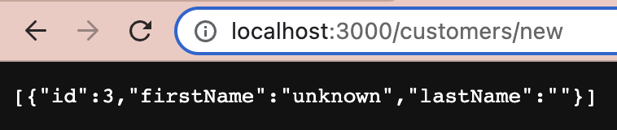

> [1편. [TypeORM] Example using TypeORM with Express](./2022-10-19-typeorm_example_express.md)  
> [2편. [TypeORM] Advanced: Query Builder](./2022-10-19-typeorm_query_builder.md)  
> 와 이어집니다.

# 시작하기 전에
이왕 시작한 거, RDBMS의 꽃인 join을 빼놓으면 섭섭하지 않을까 싶어서 준비했다. 사실 나는 SQL문 작성하는 걸 좋아하는 편이고, 특히 join문 작성하는 걸 좋아한다. 뭔가 수수께끼 푸는 기분 들어서 재밌다.  

여튼쨌든 기존에 있던 user 테이블 말고, 테이블을 하나 더 만들어보자. 대충 주문 내역을 볼 수 있는 order 테이블을 만들어보도록 하겠다. 왜 하필 주문 내역이냐면, 내가 졸업작품 만들 때 쇼핑몰을 만든 기억이 있어서 그렇지, 별 뜻은 없다(tmi 대방출).  

쿼리문은 아래와 같다.

```sql
CREATE TABLE `order`(
	id INT AUTO_INCREMENT PRIMARY KEY NOT NULL,
    userId INT NOT NULL,
    item VARCHAR(14) NOT NULL,
    price INT NOT NULL,
    FOREIGN KEY (`userId`) REFERENCES `user` (`id`)
);
```
`order.userId`가 `user.id` 참조하게 하여 둘의 관계를 생성해주었다. 이렇게 하면 `order.userId`는 `user.id`에 있는 값만 들어갈 수 있다. 일종의 제약 조건(CONSTRAINTS)과 같다.

그리고 아래와 같이 order 테이블에 데이터를 넣어주었다.

```sql
INSERT INTO `order` (userId, item, price) VALUES (1, "cereal", 10000);
INSERT INTO `order` (userId, item, price) VALUES (2, "seed", 2000);
```
추가적으로 user 테이블에 3번 유저를 한 명 더 넣어주도록 하겠다.

```sql
INSERT INTO user (firstName, lastName) VALUES ("unknown", "10");
```

위의 SQL문들을 전부 실행한 이후의 order, user 테이블의 데이터는 다음과 같다.

{: width="40%"}
{: width="50%"}

추가적으로 내가 JOIN을 함으로써 가져올 엔티티의 속성은 주문번호(orderNo), 주문한 사람(orderer), 상품(item), 가격(price)이므로 이에 따라 엔티티를 새로 만들어주도록 하겠다.  
`src/entity/order.entity.ts`에 다음과 같이 작성한다.

```typescript
import { Entity, Column, PrimaryGeneratedColumn, JoinColumn, OneToMany, ManyToOne } from "typeorm";
import { User } from "./user.entity";

@Entity()
export class Order {
	@PrimaryGeneratedColumn()
	id: number

	@OneToMany(type => User, user => user.id)
	userId: number

	@Column()
	orderer: string

	@Column()
	item: string

	@Column()
	price: number
}
```

여기서 등장한 `@OneToMany`가 있는데, 이는 데이터베이스의 관계를 나타낸다. `order` 테이블 입장에서 `user.id`는 여러 개 입력될 수 있다. 즉, 한 사용자가 여러 주문을 넣을 수 있기 때문에 "1대 다"의 관계가 성립된다. 한 개의 `user.id`가 여러 `order` 테이블의 데이터를 가질 수 있다는 것이다.  
그리고 해당 데코레이터의 인자로 참조를 하는 엔티티(테이블)와 어떤 속성(테이블의 필드)을 참조하는지도 명시해준다.

# INNER JOIN
INNER JOIN은 교집합 개념으로, ON 구문 뒤에 나오는 조건에 일치하면서 두 테이블에 데이터가 모두 있는 데이터만을 갖고 온다. 직접 SQL문을 보며 설명하도록 하겠다. 아래의 SQL문은 user 테이블과 order 테이블을 inner join하여 두 테이블에 있는 정보를 가져온다.

```sql
SELECT `order`.id as orderNo, 
        CONCAT(user.lastName, ' ', user.firstName) as orderer,
        `order`.item, 
        `order`.price
        FROM `order`
        INNER JOIN user
        ON user.id = `order`.userId;
```

`user`테이블과 `order`테이블을 `INNER JOIN`하는데, `user.id = order.userId`인 데이터들을 양쪽 테이블에서 가져온다. 즉, order와 user의 컬럼 중에 나는 `order.id`, `user.lastName, user.firstName`, `order.item`, `order.price`를 조회할 것이다.

중간중간 쓰인 `as`는 별칭이다. `order.id as orderNo`는 `order.id` 컬럼을 `orderNo`라고 부르겠다는 뜻이다.

`CONCAT()` 함수를 써서 성과 이름을 합쳐줬고, `orderer`라고 별칭을 붙였다.

위의 쿼리문을 실행하면 결과가 아래와 같이 나온다.


여기서 주목할 점은 `user` 테이블에 저장된 3번 유저의 데이터는 조회되지 않았다는 점이다. 왜냐하면 `ON user.id = order.userId` 조건에 걸렸기 때문이다.

## INNER JOIN in TypeORM
이걸 TypeORM을 이용하여 JSON 형식으로 가져오도록 하겠다. `app.ts`를 다음과 같이 작성한다.

```typescript
import express from "express"
import { Request, Response } from "express"
import { User } from "./entity/user.entity"
import { myDataSource } from "../app-data-source"

// 데이터베이스 연결
myDataSource
    .initialize()
    .then(() => {
        console.log("Data Source has been initialized!")
    })
    .catch((err) => {
        console.error("Error during Data Source initialization:", err)
    });

// express 생성 및 설정
const app = express();
app.use(express.json());

// 라우터
app.get("/order", async function (req: Request, res: Response) {
    // INNER JOIN
    const orders = await myDataSource.createQueryBuilder("order", "o")
                                        .innerJoin("user", "u", "o.userId = u.id")
                                        .select(["o.id", "orderNo")
                                        .addSelect("CONCAT(u.lastName, ' ', u.firstName)", "orderer")
                                        .addSelect("o.item", "item")
                                        .addSelect("o.price", "price")
                                        .getRawMany();
    return res.json(orders);
});

// start express server
app.listen(3000);

```

여기서 주의깊게 봐야 할 점은 `innerJoin(테이블, 별칭, 조건)` 부분이다. 위에서 작성한 SQL문에서 `INNER JOIN user` 부분이 `innerJoin()`의 첫 번째 인자로 들어갔다. SQL문에서는 내가 따로 별칭을 정해주진 않았는데, query builder에서는 user 테이블을 u라고 부르겠다는 별칭을 두 번째 인자로 넣어줬다. 그리고 마지막 세 번째 인자로 SQL문 내의 `ON user.id = order.userId` 부분을 넘겨줬다.  
그러면 `createQueryBuilder()`와 `innerjoin()`에 의해 SQL문 상의 `FROM order INNER JOIN user ON user.id = order.userId`부분이 생성되었다.

이번에는 JOIN 결과에서 어떤 컬럼들을 SELECT 할 건지를 정해줄 차례이다. JOIN한 결과를 전부 그냥 가져올 생각이라면, `innerJoin()` 함수 대신 `innerJoinAndSelect()` 함수를 쓰면 바로 해결이 된다. 그런데 나는 `CONCAT()` 함수를 쓰면서 일부 컬럼만 가져올 것이기 때문에 `select()`함수로 조회할 컬럼을 지정해주었다.  
거기에 추가적으로 여러 컬럼을 더 조회하고 싶으면 `addSelect()` 함수를 써도 되고, 아니면 `select()`함수의 인자로 컬럼 명들을 리스트의 형태로 전달해도 된다. 개인적으로는 `addSelect()`가 더 가독성 좋은 것 같다. 별칭도 한 컬럼에 하나씩 볼 수 있기도 하고.

그리고 `SUM()`이라든가 집계 함수라든가 그런 데이터들을 조회할 때에는 `getRaw...()`함수를 써야 한다. 왜냐하면 엔티티가 아니라 raw 데이터로 분류되기 때문이다.

이제 앱 실행해서 `/order` 페이지에 접속해보면 아래와 같은 화면이 뜬다.


# OUTER JOIN
INNER JOIN이 교집합이라면, OUTER JOIN은 합집합의 개념이다. OUTER JOIN은 LEFT OUTER JOIN, RIGHT OUTER JOIN으로 나뉘는데, 둘의 차이는 어떤 테이블을 중심으로 JOIN을 할 지에 있다.  
예시를 위해 위에서 지정했던 order-user 외래키 제약 조건을 잠시 해제한 이후에 진행하겠다.

```sql
SET FOREIGN_KEY_CHECKS = 0; // FOREIGN_KEY 제약 조건 임시 해제, 활성화 하려면 값 1
INSERT INTO `order`
	   (userId, price, item)
	   VALUES (4, 9999, "오류!"); 
```

이렇게 하면 user 테이블에 id가 4인 데이터가 없음에도 불구하고 `order`테이블에 위의 데이터가 정상적으로 들어간다.


이제 아래의 SQL문을 실행해보자. 먼저 `order` 테이블이 중점인 LEFT JOIN을 해보도록 하겠다.

```sql
SELECT * FROM `order` o
         LEFT OUTER JOIN user u
         ON o.userId = u.id;
```
이때 결과가 어떻게 나올까? 바로 아래와 같이 나온다.


세 번째 행을 보면 NULL 값이 들어있는 걸 볼 수 있다. 앞의 5개의 컬럼은 `order` 테이블에 입력된 값이지만, 뒤의 3개 컬럼은 `user` 테이블 내의 정보이다. 즉, **`order` 테이블에는 데이터가 있지만, `user` 테이블에는 데이터가 없어도 그 둘을 합쳐서 조회한다.**  
LEFT OUTER JOIN 일 때, OUTER JOIN이라는 글자를 기준으로 왼쪽에 있는 테이블(order)에는 데이터가 있고, 오른쪽에 있는 테이블(user)에는 데이터가 없더라도 그 값을 NULL로 채워서 가져온다고 생각하면 쉬울 것 같다.

그렇다면 반대로 RIGHT OUTER JOIN을 한다면 어떻게 될까? 예상컨대 `user` 테이블에만 데이터가 있고 `order` 테이블에는 데이터가 없는 경우, `order` 테이블의 값에 NULL이 채워진 결과가 나올 것이다.

```sql
SELECT * FROM `order` o
         RIGHT OUTER JOIN user u
         ON o.userId = u.id;
```


## OUTER JOIN in TypeORM
사실 LEFT를 하든, RIGHT를 하든 함수 이름만 다를 것이기 때문에 특정 상황을 가정해서 OUTER JOIN을 TypeORM으로 구현해보도록 하겠다.  
예를 들어 내가 쇼핑몰을 운영하는데, 주문을 전혀 한 적이 없는 신규 고객에게만 쿠폰을 발급하기로 한다고 해보자. 그러면 나는 고객들의 주문 내역을 조회해야 할 것이다. 그 중에서도 주문 내역이 없는(NULL) 사용자만 골라내서 그 사용자에게만 쿠폰을 발급해야 할 것이다.  
주문 내역이 없는 사용자를 골라내기 위해서는 `user` 테이블과 `order` 테이블을 OUTER JOIN 해야 한다.

```sql
SELECT u.*
	   FROM user u
	   LEFT OUTER JOIN `order` o
	   ON o.userId = u.id
	   WHERE ISNULL(o.id) //o.id가 NULL인 것만!
```
위의 쿼리를 실행하면, 아래와 같은 데이터가 출력된다.


이 고객님의 lastName이 어디갔는지는 모르겠는데, 상관 없으니 그대로 진행하도록 하겠다. 이제 이 sql문이 정상적으로 동작하는 걸 확인했으니, TypeORM으로 작성해보도록 하겠다.  
아까 작성한 `app.ts`에 아래의 코드를 추가하도록 하자.

```typescript
app.get("/customers/new", async function (req: Request, res: Response) {
	// LEFT OUTER JOIN
	const newCustomers = await myDataSource.createQueryBuilder("user", "u")
										   .leftJoin("order", "o", "u.id = o.userId")
										   .select("u.*")
										   .where("ISNULL(o.id)")
										   .getRawMany();
	return res.json(newCustomers);
});
```

INNER JOIN때와 크게 달라진 것은 없다. 달라진 게 있다면, 두 테이블 간의 관계가 없기 때문에 딱히 엔티티를 수정해주지 않은 것 정도? 그리고 `innerJoin()`, `leftJoin()` 결과 자체가 특정 엔티티가 아니기 때문에, raw 데이터 취급하는 것 같다. 엔티티로 반환받고 싶으면 `...JoinMap...()`의 함수를 써서 가져온 데이터를 엔티티의 속성에 매핑해주는 과정이 필요하다. 상당히 ORM에 걸맞는 함수 같다.

위의 라우터를 추가하고 해당 url로 접속하면 아래와 같은 화면이 뜬다.


